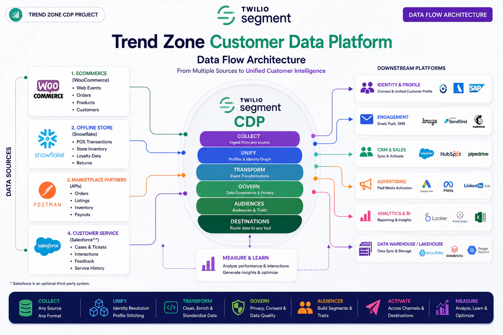
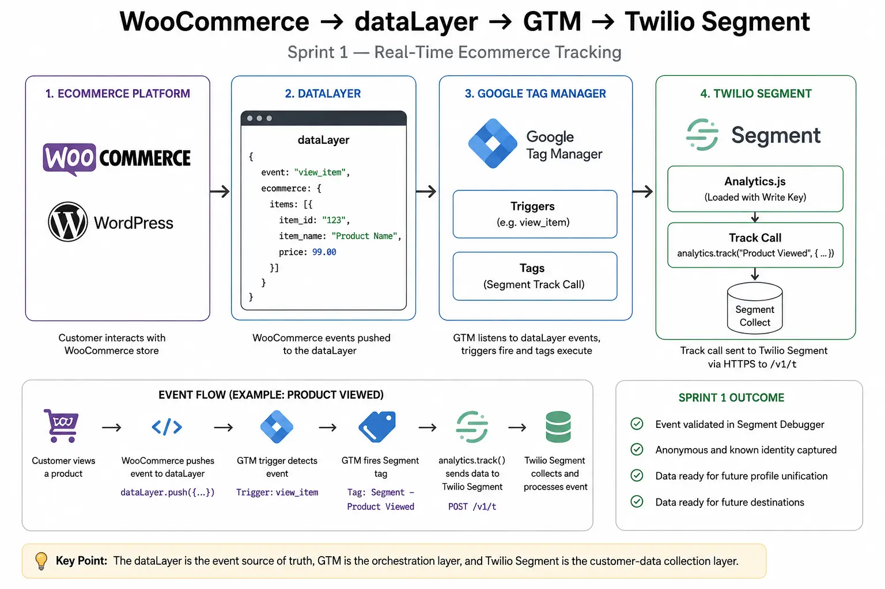
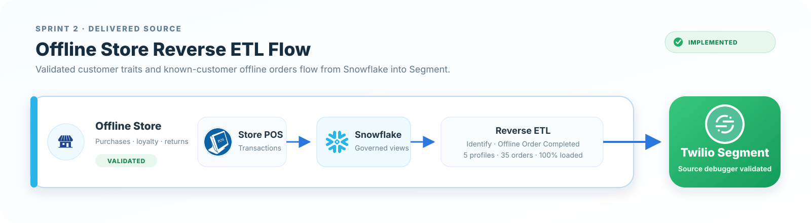
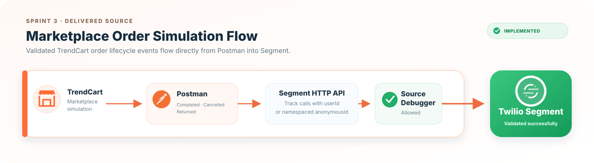
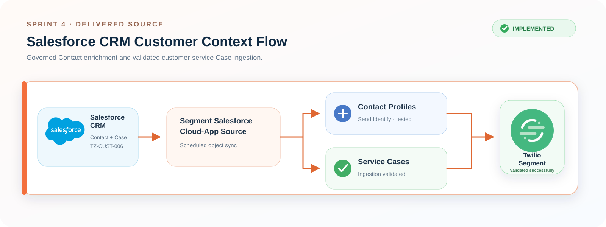
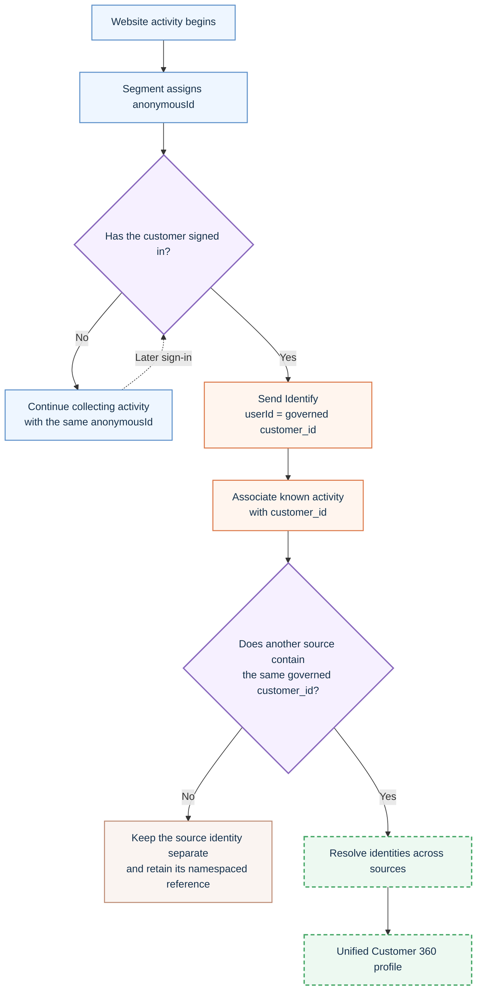
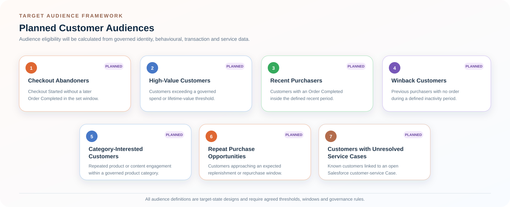

# Trend Zone Target Architecture

## Purpose

Trend Zone is designed as a four-source retail Customer Data Platform case study. The target architecture shows how real-time ecommerce behaviour, offline retail transactions, marketplace orders and customer-service activity can be collected, standardized and connected through Twilio Segment.

> **Delivery status:** All four source implementations are complete within their validated scope. WooCommerce real-time collection, Snowflake Reverse ETL, the TrendCart API simulation and Salesforce CRM ingestion have been implemented and tested. Salesforce delivered governed Contact enrichment through Identify and validated Case ingestion; unified profiles, audiences and downstream activations remain target-state phases.

<p align="center">
  
</p>

---

## Architecture at a Glance

| Source | Business role | Ingestion pattern | Delivery status |
|---|---|---|---|
| WooCommerce | Web behaviour, carts, checkout, orders and customer identity | Real-time Data Layer → GTM → Segment Analytics.js | **Completed and validated** |
| Snowflake | Offline-store customers and transactions; guest-order analysis; Segment-ready modeled events | Batch warehouse ingestion → Segment Reverse ETL | **Completed — Identify and Track validated** |
| TrendCart Marketplace (simulated) | Partner order lifecycle events | Postman → Segment HTTP Tracking API | **Completed — four scenarios, 8/8 tests passed** |
| Salesforce CRM | Governed Contact attributes and customer-service Case context | Native cloud-app object sync; Tracking API recommended for future Case lifecycle events | **Completed — Contact Identify and Case ingestion validated** |

All four systems are treated as independent upstream sources. Known-customer records use the governed Trend Zone customer ID where available; source-system record IDs remain traceability attributes and are not inserted into the WooCommerce website Data Layer.

---

## Segment Capability Layers

The central architecture is organized into six logical capabilities.

| Layer | Role in the Trend Zone project | Status |
|---|---|---|
| Collect | Capture Page, Track and Identify calls from real-time and batch sources | WooCommerce, Snowflake, TrendCart and Salesforce ingestion completed within validated scope |
| Unify | Resolve anonymous and known identities and build a unified profile | Target |
| Transform | Standardize source-specific fields into governed event and customer schemas | WooCommerce, Snowflake, TrendCart and Salesforce Contact/Case models implemented |
| Govern | Apply data-quality, privacy, consent and destination-eligibility rules | Target |
| Audiences | Build computed traits and reusable customer segments | Target |
| Destinations | Route approved profiles, events and audiences to downstream tools | Target |

The layered representation is architectural. It does not claim that Segment Unify, Engage or every illustrated destination has already been configured.

---

## Real-Time Ecommerce Flow

The implemented WooCommerce path is:

<p align="center">
  
</p>

Validated calls include:

- Page
- Identify
- Product Viewed
- Product Added
- Product Removed
- Cart Viewed
- Checkout Started
- Order Completed

The implementation also validates simple and variable products, multi-product carts, anonymous-to-known association, order totals, stale ecommerce data and duplicate-purchase prevention.

---

## Offline-Store Flow

The Snowflake batch Reverse ETL source is implemented and validated separately from the remaining planned integrations.

<p align="center">
  
</p>

The implemented Snowflake foundation models offline purchases, stores, products, known customers, and unidentified guest orders. Reverse ETL delivered five known-customer Identify calls and 35 `Offline Order Completed` Track calls, with 100% of the scheduled order batch loaded. Guest orders remain available only for aggregate Snowflake analysis.

---

## Marketplace Flow

The TrendCart marketplace simulation is completed and validated as a standalone source.

<p align="center">
  
</p>

Sprint 3 used Postman as a transparent **TrendCart marketplace simulator**. Four Segment Track requests were sent directly to the dedicated HTTP API source: known-customer completed order, marketplace-only completed order, cancelled order and returned order. The final collection run passed 8/8 assertions.

Production controls such as partner authentication, validation, deduplication and retries remain documented limitations. No direct Amazon, Flipkart or Myntra integration is claimed. See the [Sprint 3 Marketplace Simulation](../03-data-sources/marketplace/marketplace-simulation-implementation.md).

---

## Salesforce CRM Flow

The Salesforce CRM source is completed and validated for governed Contact enrichment and customer-service Case ingestion.

<p align="center">
  
</p>

Salesforce Contacts sync through the native cloud-app source into the **Salesforce Contact Profiles** model. The governed Trend Zone customer ID is mapped to Segment `userId`, while the Salesforce Contact ID is retained only for source-system traceability.

Case `00001026` was validated with customer `TZ-CUST-006`, order `TZ-ORD-1006` and its service attributes. The available native mapping exposed only Identify, so it was not used for Case activity; a production lifecycle-event extension would use Salesforce Flow or Apex with the Segment Tracking API. See [Salesforce CRM — Sprint 4 Day 3](../03-data-sources/salesforce/salesforce-crm-day-3.md).

---

## Identity Resolution Design

| Source | Source identifier |
|---|---|
| Anonymous website visitor | Segment `anonymousId` |
| WooCommerce | Trend Zone `customer_id` |
| Snowflake/offline store | Trend Zone `customer_id` |
| TrendCart marketplace | Governed Trend Zone `customer_id` when a deterministic crosswalk exists; otherwise namespaced marketplace reference as `anonymousId` |
| Salesforce CRM | Governed Trend Zone customer ID (`Trend_Zone_Customer_ID__c`); Salesforce Contact ID retained for traceability |

The desired identity transition is:



> **Diagram status:** Solid nodes represent implemented identity collection and mapping logic. Dashed green nodes represent the target cross-source resolution and Customer 360 capabilities.

The governed Trend Zone customer ID is the deterministic cross-source key for known customers. Email and phone may support controlled matching in a future identity-resolution phase, but raw personal information will not be exposed in repository screenshots or sample payloads.

---

## Target Audiences

The planned audience framework includes seven reusable customer segments:

<p align="center">
  
</p>

Cart and checkout abandonment will be derived from existing behavioural events—for example, `Checkout Started` without a subsequent `Order Completed` within the defined conversion window. It will not be generated from an unreliable browser-exit event.

---

## Downstream Activation

The diagram groups potential destinations by business purpose:

| Destination group | Intended use |
|---|---|
| Identity and profile | Synchronize approved customer context |
| Engagement | Email, push and SMS personalization |
| CRM and sales | Customer and service context |
| Advertising | Audience activation and suppression |
| Analytics and BI | Reporting, performance analysis and insight generation |
| Warehouse/lakehouse | Data storage, modelling and advanced analysis |

Platform logos in the diagram illustrate the target ecosystem. They do not imply that every platform is licensed, connected or validated.

---

## Measurement and Feedback Loop

Activation is not the end of the architecture. Campaign responses, conversions, service outcomes and analytical insights should feed the next decision cycle:

```text
Collect → Unify → Govern → Build audiences → Activate → Measure → Improve
```

This feedback loop supports audience refinement, data-quality improvements and more relevant customer experiences.

---

## Current State vs Target State

### Completed

- WordPress and WooCommerce test storefront
- GTM4WP ecommerce Data Layer
- Google Tag Manager variables, triggers and tags
- Segment Analytics.js initialization
- Page, Track and Identify calls
- Seven core ecommerce and identity events
- End-to-end QA and production smoke test
- Tracking-plan and identity documentation
- Snowflake offline-store raw tables, fictional test dataset, Segment-ready views, and data-quality validation
- Restricted service user, encrypted RSA authentication and Segment Reverse ETL connection
- Five-customer Identify batch and 35-order `Offline Order Completed` Track batch
- Sprint 2 end-to-end QA and privacy-reviewed evidence
- TrendCart direct Postman-to-Segment marketplace simulation
- Known-customer and marketplace-only identity scenarios
- Completed, cancelled and returned marketplace order events
- Four-request Postman collection with 8/8 passing assertions
- Segment Source Debugger validation and privacy-reviewed Sprint 3 evidence
- Native Salesforce CRM cloud-app source and selective sync
- Governed Salesforce Contact identity using `TZ-CUST-006`
- Salesforce Contact Profiles model and tested Send Identify mapping
- Salesforce Customer Service Cases model with Case `00001026` validated
- Customer and order references retained across Contact and Case data
- Connector-action assessment and decision not to misuse Identify for Case activity
- Recommended Salesforce Flow/Apex Tracking API pattern documented

### Planned

- Salesforce Case lifecycle Track-call extension through Flow/Apex
- Cross-source identity resolution
- Unified Customer 360 profiles
- Computed traits and audiences
- Downstream activation
- Cross-source measurement and optimization

---

## Related Documentation

- [WooCommerce Real-Time Implementation](../03-data-sources/woocommerce-real-time-implementation.md)
- [Sprint 3 Marketplace Simulation](../03-data-sources/marketplace/marketplace-simulation-implementation.md)
- [Salesforce CRM — Sprint 4 Day 1](../03-data-sources/salesforce/salesforce-crm-day-1.md)
- [Salesforce CRM — Sprint 4 Day 2](../03-data-sources/salesforce/salesforce-crm-day-2.md)
- [Salesforce CRM — Sprint 4 Day 3](../03-data-sources/salesforce/salesforce-crm-day-3.md)
- [Snowflake Offline-Store Implementation](../03-data-sources/snowflake-offline-store-implementation.md)
- [Secure Snowflake-to-Segment Reverse ETL Tutorial](../03-data-sources/snowflake/secure-reverse-etl-tutorial.md)
- [Sprint 2 Snowflake Reverse ETL QA](../07-testing-and-validation/sprint-2-snowflake-reverse-etl-qa.md)
- [Ecommerce Event Tracking Plan](../04-data-design/event-tracking-plan.md)
- [Identity Implementation](../05-identity-resolution/identity-implementation.md)
- [Sprint 1 End-to-End QA](../07-testing-and-validation/sprint-1-end-to-end-qa.md)
