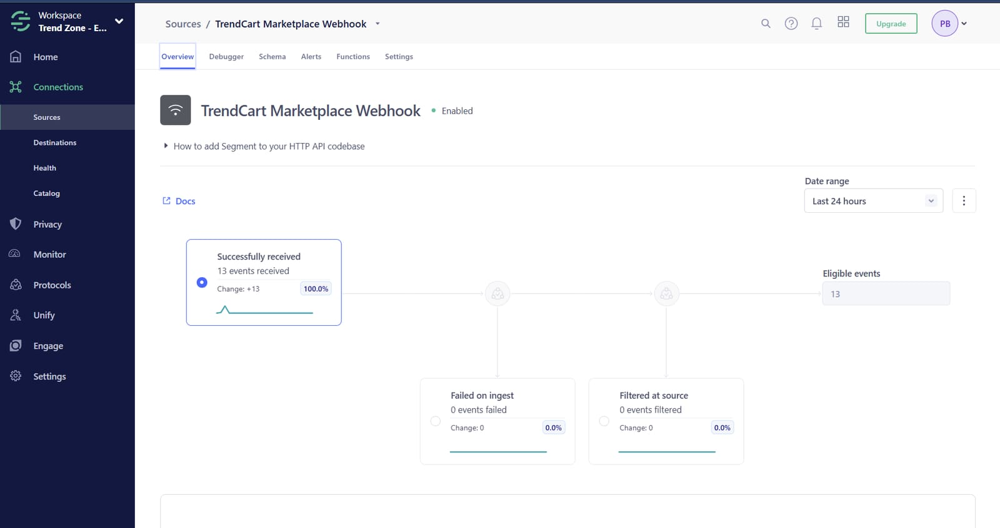
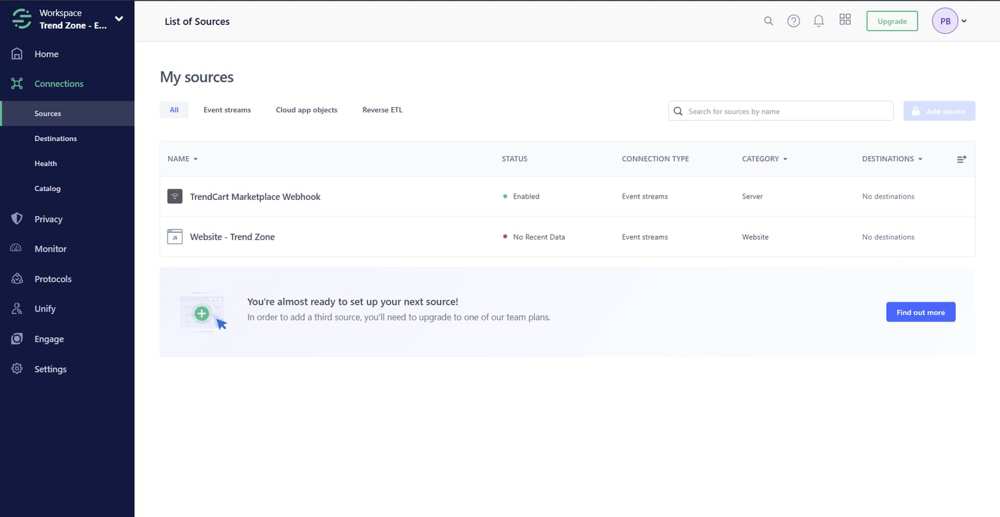
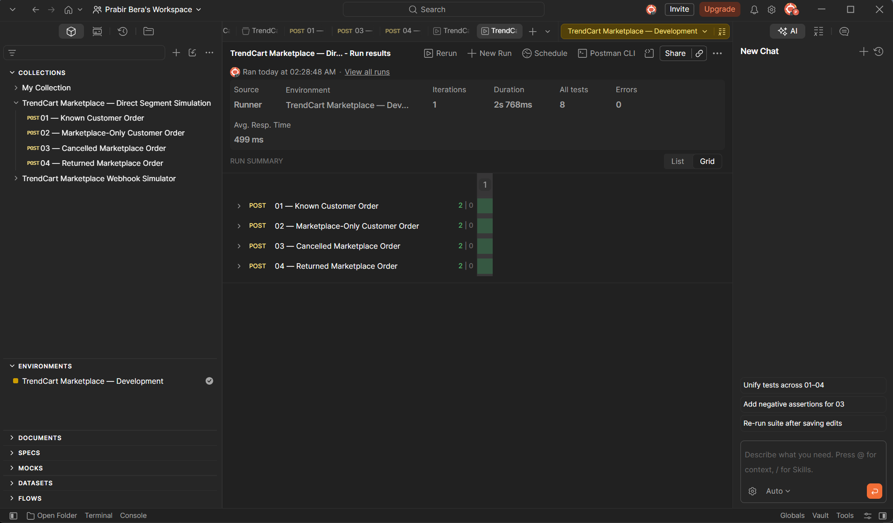
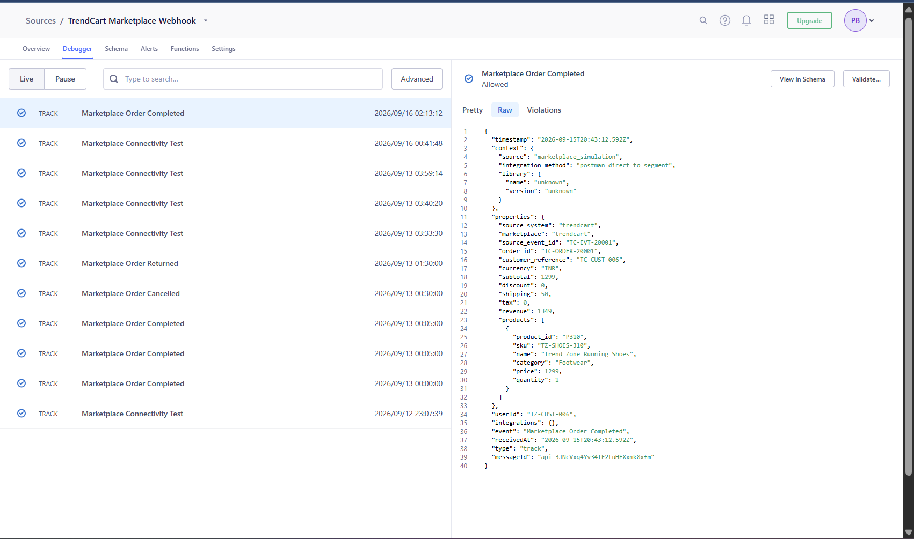
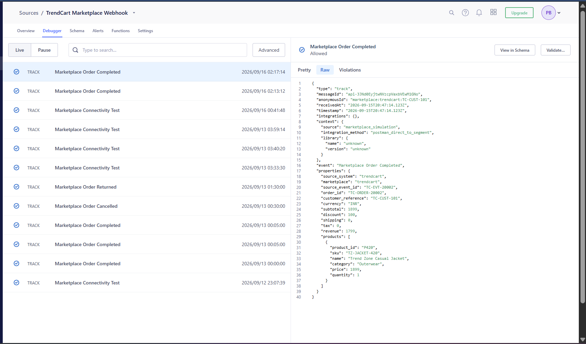
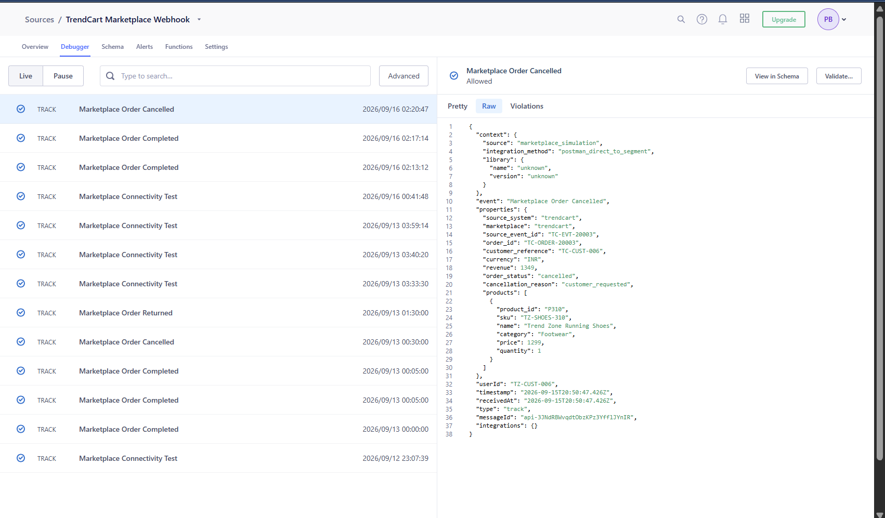
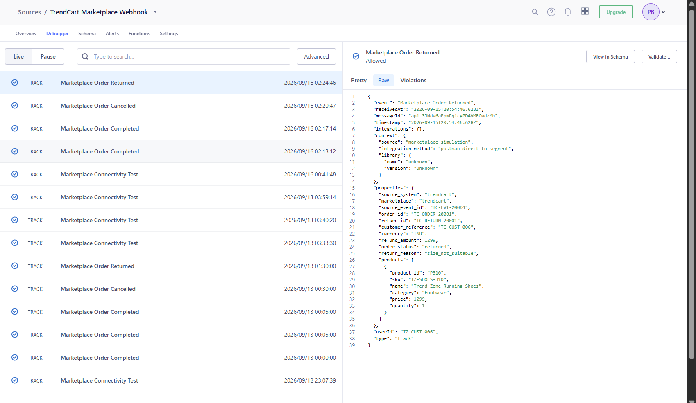

# TrendCart Marketplace Simulation

## Status

> **Sprint 3 — completed and validated.** Four simulated marketplace scenarios were sent directly from Postman to a dedicated Segment HTTP API source. The final collection run passed **8/8 automated assertions** with **0 errors**, and each event was verified as Allowed in Segment Source Debugger.

## Source lifecycle evidence

### Source overview

The source overview recorded **13 successfully received events**, **13 eligible events**, **0 failed events** and **0 filtered events**.



### Workspace source list

The workspace source list shows the enabled TrendCart marketplace source alongside the WooCommerce website source. It also records the free-plan restriction requiring an upgrade before a third source could be added.



> **Lifecycle note:** After Sprint 3 validation and evidence capture, the TrendCart source was retired to release the limited source slot for the planned Salesforce CRM implementation. The Postman collection, payloads, automated tests, screenshots and implementation documentation remain preserved in this repository.

## Portfolio disclosure

TrendCart is fictional. This implementation demonstrates the structure, identity treatment and validation of marketplace events without claiming access to, or a production integration with, Amazon, Flipkart or Myntra.

## Implemented flow

```text
Postman marketplace simulation
        ↓
Segment HTTP Tracking API
        ↓
TrendCart Marketplace source
        ↓
Allowed events in Source Debugger
```

Postman represents the simulated partner/API boundary and sends Segment Track payloads directly. The implementation is intentionally scoped as a clear, reproducible portfolio demonstration.

## Source configuration

A dedicated Segment HTTP API source receives the simulated events. Its Write Key is stored only in a private Postman environment.

| Private Postman variable | Purpose |
|---|---|
| `segment_track_url` | `https://api.segment.io/v1/track` |
| `segment_write_key` | Dedicated source Write Key; never committed |

Authentication uses HTTP Basic Auth with the Write Key as the username and a blank password.

## Implemented scenarios

| Request | Segment event | Identity | Key outcome |
|---|---|---|---|
| 01 — Known Customer Order | `Marketplace Order Completed` | `userId = TZ-CUST-006` | Existing customer can join the cross-channel profile |
| 02 — Marketplace-Only Customer Order | `Marketplace Order Completed` | `anonymousId = marketplace:trendcart:TC-CUST-101` | Restricted marketplace identity remains namespaced |
| 03 — Cancelled Marketplace Order | `Marketplace Order Cancelled` | `userId = TZ-CUST-006` | Cancellation reason and status are captured |
| 04 — Returned Marketplace Order | `Marketplace Order Returned` | `userId = TZ-CUST-006` | Return ID, reason and refund amount are captured |

All payloads include source metadata, marketplace/order identifiers, currency and appropriate product or lifecycle properties.

## Automated validation

Each request contains two Postman assertions:

1. Segment returns HTTP `200`.
2. The JSON response contains `success: true`.

The final Functional Runner result passed all four requests and **8/8 tests**, with **0 errors**.



## Segment evidence

### Known customer

The completed-order event was Allowed with `userId = TZ-CUST-006`.



### Marketplace-only customer

The completed-order event was Allowed with the namespaced anonymous identity `marketplace:trendcart:TC-CUST-101`.



### Cancelled order

The cancellation event was Allowed with cancellation status and reason.



### Returned order

The return event was Allowed with return ID, refund amount and return reason.



## Reuse

Import [the Postman Collection v2.1](postman/trendcart-direct-segment-simulation.postman_collection.json) and follow the [setup instructions](postman/README.md). The export contains variable references only and no credentials.

## Product judgment and trade-off

Direct Postman-to-Segment delivery was selected because it demonstrates the portfolio's core marketplace-source objective in a reproducible form: event design, known-versus-anonymous identity handling, API authentication, repeatable tests and downstream verification. It does **not** represent production-grade marketplace ingestion.

## Limitations

A production partner integration would normally add:

- Marketplace-native authentication and request-signature verification
- Contract validation and schema enforcement before ingestion
- Durable idempotency and duplicate suppression
- Retry, dead-letter and monitoring controls
- Secret management and environment separation
- Partner-specific rate-limit and privacy handling

These are documented as production considerations rather than claimed as completed capabilities.
