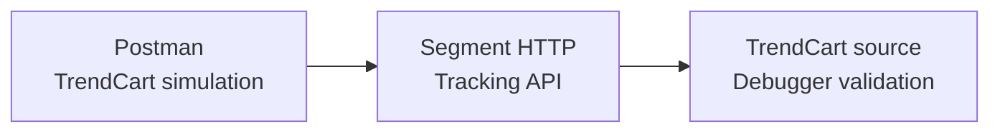

# Sprint 3 — Marketplace Simulation Delivery Plan

## Sprint summary

| Item | Delivered outcome |
|---|---|
| Target dates | Sep 11–17, 2026 |
| Source | TrendCart Marketplace (fictional simulation) |
| Ingestion pattern | Direct Postman-to-Segment HTTP API |
| Status | **Completed and validated** |
| Core events | `Marketplace Order Completed`, `Marketplace Order Cancelled`, `Marketplace Order Returned` |
| Automated result | Four requests, **8/8 tests passed**, zero errors |

> **Portfolio disclosure:** TrendCart is fictional. The sprint simulates marketplace/partner events and does not claim a live Amazon, Flipkart or Myntra integration.

## Sprint goal

Demonstrate how marketplace order-lifecycle data can enter Segment with governed event names, appropriate commerce properties and explicit known-versus-marketplace-only identity treatment.

## Delivered scope

Postman represents the simulated partner/API boundary. A private environment stores the Segment endpoint and Write Key; the exported collection contains variable references only.

## Event and identity contract

| Scenario | Segment event | Identifier |
|---|---|---|
| Known customer order | Marketplace Order Completed | Governed Trend Zone `userId` |
| Marketplace-only order | Marketplace Order Completed | Namespaced stable `anonymousId` |
| Cancelled order | Marketplace Order Cancelled | Governed Trend Zone `userId` |
| Returned order | Marketplace Order Returned | Governed Trend Zone `userId` |

A marketplace customer reference is not automatically promoted to a Trend Zone `userId`. When no deterministic crosswalk exists, the stable source reference remains namespaced as `marketplace:trendcart:<reference>`.

## Validation completed

- Segment accepted each request with HTTP `200` and `success: true`.
- Each event was visible and Allowed in Source Debugger.
- Known customer `TC-CUST-006` used `userId = TZ-CUST-006`.
- Marketplace-only customer `TC-CUST-101` used a namespaced `anonymousId`.
- Order, product, revenue, cancellation, return and refund properties were inspected.
- Collection Runner passed all eight assertions with zero errors.
- The exported collection was reviewed to confirm that no Write Key or other credential was embedded.

## Scope decision

The sprint was deliberately scoped to direct Postman-to-Segment delivery so the marketplace simulation is easy to reproduce, validate and explain. Production integration controls remain outside the demonstrated scope.

## Definition of Done

- [x] Dedicated Segment HTTP API source available
- [x] Direct Postman authentication configured privately
- [x] Known and marketplace-only identity scenarios validated
- [x] Completed, cancelled and returned lifecycle events validated
- [x] Four reusable requests exported without credentials
- [x] Eight automated assertions passed
- [x] Segment Debugger evidence captured
- [x] Architecture, implementation and project status updated

## Production considerations

This simulation does not provide marketplace-native request authentication, pre-ingestion contract validation, durable deduplication, retry/dead-letter processing or operational monitoring. Those controls would be required for a production integration and are not claimed as completed.

See the [implementation and evidence](marketplace-simulation-implementation.md) and [Postman reuse instructions](postman/README.md).
