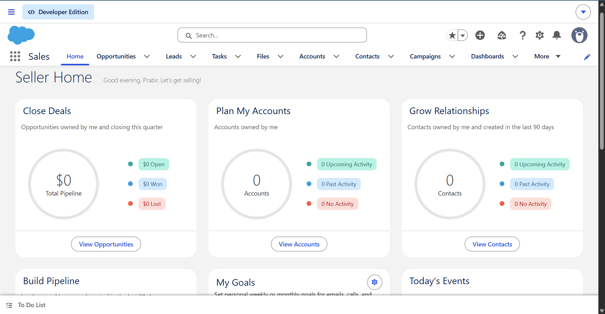
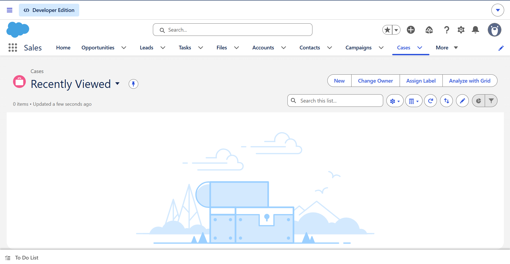
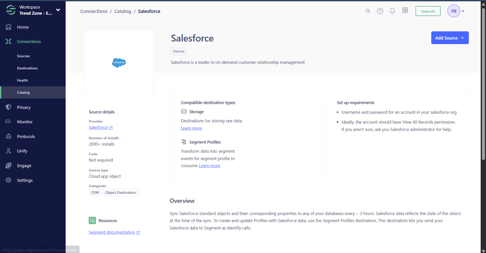
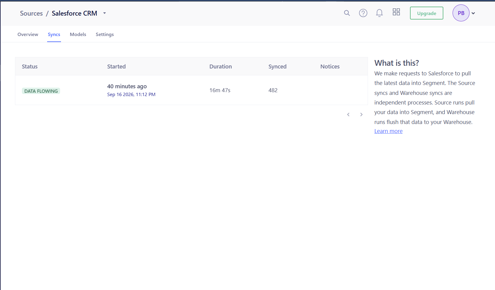
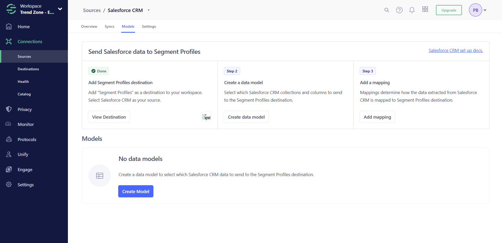

# Salesforce CRM Source — Day 1

## Status

**Sprint 4, Day 1 — completed and validated.** A Salesforce Developer Edition environment was created, the standard Contact and Case objects were verified, Salesforce CRM was connected as a native Segment cloud-app source, and the initial source sync completed successfully. A Segment Profiles destination was also attached in preparation for identity-safe profile enrichment.

> **Deliberate stopping point:** The Segment data model and field mapping were not created on Day 1. They remain deferred until the canonical `Trend_Zone_Customer_ID__c` field exists in Salesforce, preventing Salesforce Contact IDs from fragmenting customer profiles already identified through WooCommerce.

## Implementation evidence

### Salesforce CRM environment

The Salesforce Developer Edition provides an isolated portfolio environment with access to the standard CRM objects required for the customer-service use case.



### Customer-service object availability

The standard Case object was enabled and added to the Sales application navigation. Contact represents the customer; Case represents the service interaction.



### Native Segment source

Segment exposes Salesforce as a native cloud-app object source with support for storage destinations and Segment Profiles.



### Initial synchronization

The first Salesforce source pull completed with **Data Flowing** status and reported **482 synchronized records**.



### Segment Profiles destination

The Salesforce CRM source was connected to Segment Profiles. Data-model creation and mapping are intentionally reserved for Day 2 after the canonical Trend Zone customer ID is available.



## Objective

Establish a real Salesforce CRM source for Trend Zone and prove that Segment can extract customer and support data without claiming a production Salesforce implementation.

The Day 1 scope covered:

- Salesforce environment and object availability
- Native Salesforce-to-Segment authentication
- Selective synchronization of Contact and Case
- Initial source-pull validation
- Segment Profiles destination setup
- Identity architecture and stopping criteria

## Implemented flow

```text
Salesforce Developer Edition
        ↓
Contact + Case objects
        ↓
Native Segment Salesforce Source
        ↓
Salesforce data models
        ↓
Segment Profiles mapping
        ↓
identify() calls and unified customer traits
```

The source connection and destination are implemented. The data-model and `identify()` mapping stages begin on Day 2.

## Salesforce object scope

| Object | Portfolio role | Day 1 status |
|---|---|---|
| Contact | Customer identity and CRM traits | Available and selected |
| Case | Customer-service interaction | Available and selected |
| Account | Optional customer/account context | Not included in the initial scope |
| Lead, Opportunity, Campaign | Sales and marketing operations | Out of scope |

Starting with Contact and Case keeps the implementation aligned with the customer-service use case and avoids importing irrelevant Salesforce collections.

## Selective Sync configuration

### Contact fields

| Field | Purpose |
|---|---|
| `Id` | Required Salesforce record identifier |
| `AccountId` | Optional relationship context |
| `CreatedDate` | Record creation timestamp |
| `Email` | Customer identity trait |
| `FirstName` | Customer profile trait |
| `LastName` | Customer profile trait |
| `LastModifiedDate` | Incremental-change context |
| `Phone` | Customer profile trait |

### Case fields

| Field | Purpose |
|---|---|
| `Id` | Required Salesforce record identifier |
| `AccountId` | Optional account relationship |
| `CaseNumber` | Human-readable case reference |
| `ClosedDate` | Resolution timestamp |
| `ContactId` | Relationship to the customer Contact |
| `CreatedDate` | Case creation timestamp |
| `Description` | Support issue context |
| `IsClosed` | Resolution-state indicator |
| `Origin` | Service channel |
| `OwnerId` | Assigned service owner |
| `Priority` | Support urgency |
| `Reason` | Case reason |
| `Status` | Case lifecycle state |
| `Subject` | Support-case summary |
| `Type` | Case classification |

Trend Zone custom fields will be added to Selective Sync after they are created in Salesforce.

## Identity decision

The existing Trend Zone customer ID remains the canonical Segment `userId` across sources.

```text
WooCommerce customer_id = TZ-CUST-1001
Salesforce Trend_Zone_Customer_ID__c = TZ-CUST-1001
Segment userId = TZ-CUST-1001
```

The Salesforce Contact ID will be retained as a source-system trait, not used as the primary Segment `userId`. Email may support matching and profile context but is not the canonical identifier.

This decision prevents the same person from becoming separate WooCommerce and Salesforce profiles.

## Product judgment and trade-off

The native Salesforce Source was selected as the primary Sprint 4 ingestion pattern because it demonstrates a genuine supported CRM integration, selective object extraction and scheduled synchronization. A custom Salesforce Flow or Apex callout to the Segment HTTP Tracking API remains a possible real-time enhancement, but it is not required to prove the core CRM-source objective.

The implementation intentionally stopped before data-model mapping. Moving faster by mapping the Salesforce Contact ID would create an identity-design defect that would be harder to correct later.

## Security and portfolio controls

- Salesforce and Segment credentials are not stored in the repository.
- No access tokens, session details or source secrets are documented.
- Only synthetic customer data will be created.
- Real customer PII will not be used.
- The repository does not claim a production Salesforce deployment.

## Day 1 outcome

| Check | Result |
|---|---|
| Salesforce Developer Edition created | Passed |
| Contact and Case objects available | Passed |
| Salesforce authenticated with Segment | Passed |
| Contact and Case collections selected | Passed |
| Relevant standard columns selected | Passed |
| Initial source pull | Passed — Data Flowing |
| Segment Profiles destination connected | Passed |
| Canonical identity strategy | Finalized |
| Data model and field mapping | Deferred to Day 2 by design |

## Next step — Day 2

Day 2 will create the required Salesforce custom fields, including `Trend_Zone_Customer_ID__c`, populate synthetic Contact and Case records, add the new columns to Selective Sync, and then create an identity-safe Contact data model for Segment Profiles.
