# Snowflake Offline-Store Implementation

## Status

> **Sprint 2 — completed and validated.** The Snowflake data model, test dataset, Segment-ready views and quality checks are complete. A dedicated service user, least-privilege role and encrypted RSA key-pair connection to Segment were implemented. Both the customer-traits Identify flow and the known-customer offline-order Track flow passed manual and scheduled validation.

## Objective

This source models physical-store purchases so that Trend Zone can combine offline transactions with WooCommerce activity in Twilio Segment.

The implementation demonstrates a key Customer 360 principle: a purchase is associated with a known customer only when the source supplies a reliable stable identifier.

## Source Architecture

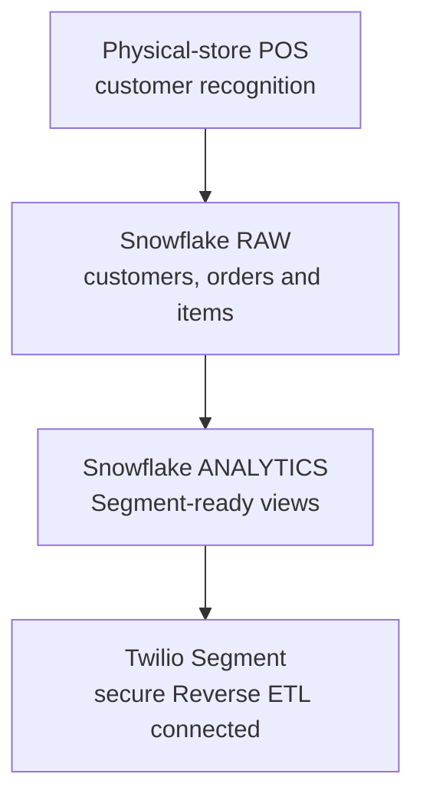

A production POS would identify a customer using a registered phone number, email, loyalty card, membership number, or application QR code. It would resolve that identifier to Trend Zone's internal customer ID before creating the order record.

For this portfolio, POS recognition is simulated with fictional test data. The project does not claim that a live POS integration has been implemented.

## Identity Contract

The five validated WooCommerce test customers use the following stable identifiers:

| Customer | WooCommerce user ID | Segment userId | Snowflake customer ID |
|---|---:|---|---|
| Aarav Mehta | 3 | `TZ_3` | `TZ_3` |
| Neha Kapoor | 4 | `TZ_4` | `TZ_4` |
| Kabir Rao | 5 | `TZ_5` | `TZ_5` |
| Mira Sen | 6 | `TZ_6` | `TZ_6` |
| Rohan Iyer | 7 | `TZ_7` | `TZ_7` |

Each identity was validated through a real WooCommerce login and Twilio Segment Identify call. Product-view behaviour was then generated while the customer was authenticated.

## Raw Data Model

The implementation uses five normalized tables in the `TREND_ZONE_CDP.RAW` schema:

| Table | Purpose |
|---|---|
| `CUSTOMERS` | Known customer traits and customer-origin classification |
| `STORES` | Physical-store reference data |
| `PRODUCTS` | Product catalogue and category information |
| `OFFLINE_ORDERS` | Offline transaction header, payment, totals, channel, and customer reference |
| `OFFLINE_ORDER_ITEMS` | Product-level transaction lines |

Orders and order items are stored separately so one transaction can contain multiple products.

## Detailed Physical Data Model

The following model documents the implemented Snowflake schema. Relationships are logical relationships used by the transformation SQL; Snowflake is used here as an analytical platform rather than as a transactional system enforcing foreign keys.

<p align="center">
  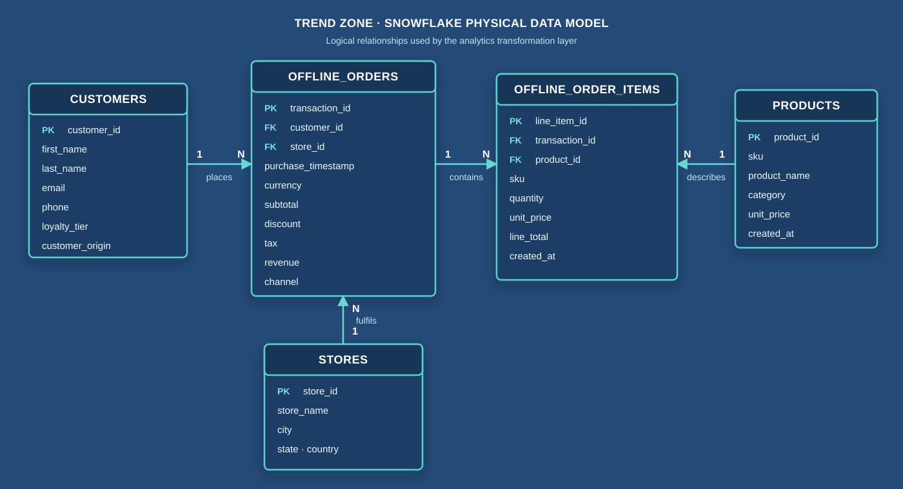
</p>

_The diagram summarizes the implemented logical relationships. The complete physical column definitions follow below._

### RAW.CUSTOMERS

| Column | Type | Description |
|---|---|---|
| CUSTOMER_ID | VARCHAR(50) | Stable Trend Zone customer identifier; maps to Segment userId for known customers |
| FIRST_NAME | VARCHAR(100) | Fictional customer first name |
| LAST_NAME | VARCHAR(100) | Fictional customer last name |
| EMAIL | VARCHAR(255) | Fictional customer email trait |
| PHONE | VARCHAR(30) | Fictional customer phone trait |
| LOYALTY_TIER | VARCHAR(30) | Loyalty classification: Bronze, Silver, or Gold |
| CUSTOMER_SINCE | DATE | Customer relationship start date |
| CUSTOMER_ORIGIN | VARCHAR(50) | CROSS_CHANNEL_VALIDATED or OFFLINE_ONLY_SIMULATED |
| CREATED_AT | TIMESTAMP_TZ | Record creation timestamp |

### RAW.STORES

| Column | Type | Description |
|---|---|---|
| STORE_ID | VARCHAR(50) | Unique physical-store identifier |
| STORE_NAME | VARCHAR(150) | Store display name |
| CITY | VARCHAR(100) | Store city |
| STATE | VARCHAR(100) | Store state |
| COUNTRY | VARCHAR(100) | Store country |
| CREATED_AT | TIMESTAMP_TZ | Record creation timestamp |

### RAW.PRODUCTS

| Column | Type | Description |
|---|---|---|
| PRODUCT_ID | VARCHAR(50) | Unique product identifier |
| SKU | VARCHAR(100) | Product stock-keeping unit |
| PRODUCT_NAME | VARCHAR(255) | Product display name |
| CATEGORY | VARCHAR(100) | Trend Zone merchandise category |
| UNIT_PRICE | NUMBER(12,2) | Standard product price in INR |
| CREATED_AT | TIMESTAMP_TZ | Record creation timestamp |

### RAW.OFFLINE_ORDERS

One row represents one completed physical-store transaction. A guest purchase has a null CUSTOMER_ID.

| Column | Type | Description |
|---|---|---|
| TRANSACTION_ID | VARCHAR(50) | Unique offline transaction ID; retained as `properties.transaction_id` for business traceability |
| CUSTOMER_ID | VARCHAR(50) | Known customer reference; null for an unidentified guest |
| STORE_ID | VARCHAR(50) | Store fulfilling the transaction |
| PURCHASE_TIMESTAMP | TIMESTAMP_TZ | Time of the physical-store purchase |
| CURRENCY | VARCHAR(3) | ISO currency code, implemented as INR |
| SUBTOTAL | NUMBER(12,2) | Sum of product line totals before discount |
| DISCOUNT | NUMBER(12,2) | Order-level discount |
| TAX | NUMBER(12,2) | Tax amount; currently modeled as zero in the test data |
| REVENUE | NUMBER(12,2) | Final order revenue after discount and tax |
| PAYMENT_METHOD | VARCHAR(50) | UPI, card, or cash |
| CHANNEL | VARCHAR(30) | Fixed value: offline_store |
| CREATED_AT | TIMESTAMP_TZ | Record creation timestamp |

### RAW.OFFLINE_ORDER_ITEMS

One row represents one product line within a physical-store transaction.

| Column | Type | Description |
|---|---|---|
| LINE_ITEM_ID | VARCHAR(50) | Unique order-line identifier |
| TRANSACTION_ID | VARCHAR(50) | Parent offline transaction reference |
| PRODUCT_ID | VARCHAR(50) | Product reference |
| SKU | VARCHAR(100) | Product SKU captured at transaction time |
| QUANTITY | NUMBER(10,0) | Purchased quantity |
| UNIT_PRICE | NUMBER(12,2) | Price per unit at transaction time |
| LINE_TOTAL | NUMBER(12,2) | Quantity multiplied by unit price |
| CREATED_AT | TIMESTAMP_TZ | Record creation timestamp |

### Analytics and Segment-Ready Model

The raw tables are transformed into three analytical views:

| View | Grain | Key columns | Consumer |
|---|---|---|---|
| ANALYTICS.SEGMENT_OFFLINE_ORDERS | One known-customer offline order | MESSAGE_ID, USER_ID, EVENT_NAME, EVENT_TIMESTAMP, REVENUE, PRODUCTS | Segment Reverse ETL |
| ANALYTICS.SEGMENT_CUSTOMER_TRAITS | One known customer | USER_ID, contact traits, loyalty tier, offline purchase metrics | Segment Identify/trait mapping |
| ANALYTICS.OFFLINE_GUEST_ORDERS | One guest transaction | Transaction, store, payment, and revenue fields | Snowflake-only aggregate analysis |

The PRODUCTS column in SEGMENT_OFFLINE_ORDERS is an ordered array of product objects. It preserves product-level detail for a commerce Track event while retaining one event row per transaction.

---

## Dataset Design

The implemented fictional dataset contains 50 offline orders and nine products across Women, Men, Footwear, and Accessories.

| Order population | Orders | Segment treatment |
|---|---:|---|
| Validated cross-channel customers | 5 | Eligible for Segment Track events |
| Simulated known offline-only customers | 30 | Eligible for Segment Track events |
| Unidentified guest shoppers | 15 | Retained for Snowflake analysis only |
| **Total** | **50** |  |

The 15 guest transactions retain a null `customer_id`. They are not forced onto a known customer profile and are intentionally excluded from the Segment event model.

## Transformation Layer

Three analytical views prepare the data for downstream use:

| View | Rows at implementation | Purpose |
|---|---:|---|
| `SEGMENT_OFFLINE_ORDERS` | 35 | One known-customer order per row, including a products array and Segment `userId` |
| `SEGMENT_CUSTOMER_TRAITS` | 35 | Customer traits plus offline order count, total spend, and most recent purchase |
| `OFFLINE_GUEST_ORDERS` | 15 | Guest-order analysis retained outside the known-customer Segment model |

### Segment event model

The `SEGMENT_OFFLINE_ORDERS` view maps each known transaction to:

```text
Event name: Offline Order Completed
Message ID: transaction_id
Segment userId: customer_id
```

Core properties include:

- `transaction_id`
- `event_timestamp`
- `revenue`
- `currency`
- `store_id`, `store_name`, and store location
- `payment_method`
- `channel = offline_store`
- `products` array with product, SKU, category, quantity, price, and line total

## Data-Quality Validation

The transformation layer and publication-ready dataset were validated with the following checks:

| Check | Result |
|---|---:|
| Known events without a user ID | 0 |
| Duplicate message IDs | 0 |
| Empty product arrays | 0 |
| Order-total mismatches | 0 |
| Guest orders in Segment model | 0 |
| Invalid customer phone formats | 0 |
| Placeholder email domains | 0 |

This confirms that orders intended for Reverse ETL contain a stable customer ID, a unique event identifier, non-empty product data, and reconciled order totals.

## Reproducible Implementation Package

The repository includes a reusable implementation package under [`03-data-sources/snowflake/`](snowflake/):

| Asset | Purpose |
|---|---|
| [Package guide](snowflake/README.md) | Execution order, expected results, privacy notes and reuse guidance |
| [CSV seed data](snowflake/data/) | Exact fictional exports for all five RAW tables |
| [Snowflake SQL](snowflake/sql/) | Environment setup, table DDL, exact seed inserts, analytical views, quality checks and validation queries |
| [Excel reference workbook](snowflake/reference/trend-zone-snowflake-dataset.xlsx) | Formatted raw tables, data dictionary, expected results, quality controls and query index |

The numbered SQL scripts reconstruct the validated dataset from an empty Snowflake environment. After execution, users should obtain 35 customers, two stores, nine products, 50 offline orders, 63 order lines and total offline revenue of INR 111,242.30. All seven data-quality issue counts should return zero.

This package separates executable assets from explanatory documentation: the Markdown page explains the architecture and design decisions, while the SQL and CSV files make the implementation independently reproducible.

## Secure Reverse ETL Implementation

Sprint 2 Day 4 established the secure activation path from Snowflake to Segment.

| Component | Implemented design |
|---|---|
| Authentication | Encrypted 2048-bit RSA private key in Segment; matching public key on Snowflake service user |
| Snowflake user | Dedicated `TYPE = SERVICE` user: `TZ_SEGMENT_REVERSE_ETL_USER` |
| Snowflake role | Dedicated `TZ_SEGMENT_REVERSE_ETL_ROLE` |
| Read boundary | SELECT only on `SEGMENT_CUSTOMER_TRAITS` and `SEGMENT_OFFLINE_ORDERS` |
| Raw-data boundary | No access to the `RAW` schema |
| Segment state | Write access isolated to `__SEGMENT_REVERSE_ETL` |
| Segment model | `Validated Offline Customer Traits`, filtered to five cross-channel customers |
| Mapping | Added or updated rows mapped to Segment `Identify` calls |
| Schedule | Daily at 8:00 PM IST |

### Validated customer-traits model

The first activated model deliberately limits the initial scope to customers already proven online through WooCommerce:

```sql
SELECT
    USER_ID,
    FIRST_NAME,
    LAST_NAME,
    EMAIL,
    PHONE,
    LOYALTY_TIER,
    CUSTOMER_SINCE,
    CUSTOMER_ORIGIN,
    OFFLINE_ORDER_COUNT,
    OFFLINE_TOTAL_SPEND,
    OFFLINE_LAST_PURCHASE_AT
FROM TREND_ZONE_CDP.ANALYTICS.SEGMENT_CUSTOMER_TRAITS
WHERE CUSTOMER_ORIGIN = 'CROSS_CHANNEL_VALIDATED'
```

`USER_ID` is the model's unique identifier. The preview returned `TZ_3` through `TZ_7`, matching the five customers previously identified through the real-time WooCommerce source.

### Free-plan constraint and decision

A production implementation would create a dedicated HTTP API source to receive calls from the Segment Connections destination. The portfolio workspace had reached the Segment Free source limit, so the existing `Website - Trend Zone` source Write Key was reused as the Tracking API endpoint.

This decision preserves the working identity contract and allows the integration to be validated, but warehouse and website calls share one Source Debugger. The limitation is documented rather than presented as the recommended production topology.

### Identify mapping

| Snowflake field | Segment mapping |
|---|---|
| `USER_ID` | `userId` |
| Customer attributes | Nested `traits` |
| Anonymous ID | Not populated |
| Record condition | Added or updated records |

The known `USER_ID` is not copied into `anonymousId`. Anonymous identifiers represent browser or device state before identification and must not be fabricated from a known customer ID.

### Validation completed

A test row for `TZ_7` was delivered successfully from Snowflake through Segment Connections. The Source Debugger received an `Identify` call containing the correct `userId`, customer traits, numeric offline-order metrics and no `anonymousId`; no protocol violation was reported.

The first scheduled batch completed successfully on September 4, 2026. At approximately 8:05 PM IST, the Source Debugger received Identify calls for all five expected users: `TZ_3`, `TZ_4`, `TZ_5`, `TZ_6`, and `TZ_7`. This validates the scheduled extraction, model filter, stable-ID mapping and Segment Connections delivery path end to end.

For the full reusable procedure, commands, troubleshooting and production rotation guidance, see the [Secure Snowflake-to-Segment Reverse ETL Tutorial](snowflake/secure-reverse-etl-tutorial.md). The executable grants are stored in [07-configure-segment-reverse-etl-access.sql](snowflake/sql/07-configure-segment-reverse-etl-access.sql).

## Privacy and Scope

All customer names, phone numbers, email addresses, products, stores, and transactions in this source are fictional portfolio data.

Sprint 2 is complete: customer-traits Identify and known-customer offline-order Track flows passed manual and scheduled validation.


---

## Final Reverse ETL Implementation

Two governed models were activated through the same Snowflake Reverse ETL source.

| Model | Unique identifier | Segment action | Delivery rule | Validated result |
|---|---|---|---|---|
| `Validated Offline Customer Traits` | `USER_ID` | Send Identify | Added or updated records | 5 scheduled Identify calls received |
| `Known Customer Offline Orders` | `MESSAGE_ID` | Send Track | Added records | 35 extracted and 100% loaded |

### Offline Order Completed mapping

| Snowflake field | Segment field |
|---|---|
| `USER_ID` | `userId` |
| `EVENT_TIMESTAMP` | `timestamp` |
| `EVENT_NAME` | `event` |
| Transaction, value, store, channel and product fields | `properties` |

The final event properties use lowercase names: `transaction_id`, `currency`, `subtotal`, `discount`, `tax`, `revenue`, `payment_method`, `channel`, `customer_origin`, `store_id`, `store_name`, `store_city`, `store_state`, and `products`.

The `products` array retains `product_id`, `sku`, `name`, `category`, `quantity`, `price`, and `line_total` for every order line.


### Payload validation

A representative cross-channel order reached the Segment Source Debugger as an allowed `track` event. The source timestamp was converted correctly to UTC, the stable customer ID populated `userId`, the product lines were preserved, and the financial values reconciled.


### Scheduled-run validation

The production-style scheduled run completed successfully on September 5, 2026. Segment reported 35 records extracted, 100% loaded and a 29-second duration.


### Message ID limitation

The model uses `MESSAGE_ID` as its Reverse ETL unique identifier, allowing Segment to checkpoint source rows. The destination mapping did not expose a dedicated top-level `messageId` field, so Segment generated the Tracking API message ID. The business transaction remains traceable through `properties.transaction_id`.

This is acceptable for portfolio validation, but a replay or checkpoint reset could produce another event for the same transaction. A production implementation should map a deterministic event-level message ID where the destination supports it, or enforce downstream idempotency using `transaction_id`.

## Sprint 2 Implementation Evidence

The following privacy-reviewed screenshots preserve the working implementation before the Snowflake source is rotated out of the Segment Free workspace. All customers, stores, products and transactions shown are fictional portfolio data.

### 1. Snowflake source and governed models

The Snowflake Reverse ETL source was configured as `Snowflake - Trend Zone Offline Retail PROD`. Two governed SQL models handled separate responsibilities: customer-trait enrichment and known-customer offline-order delivery.

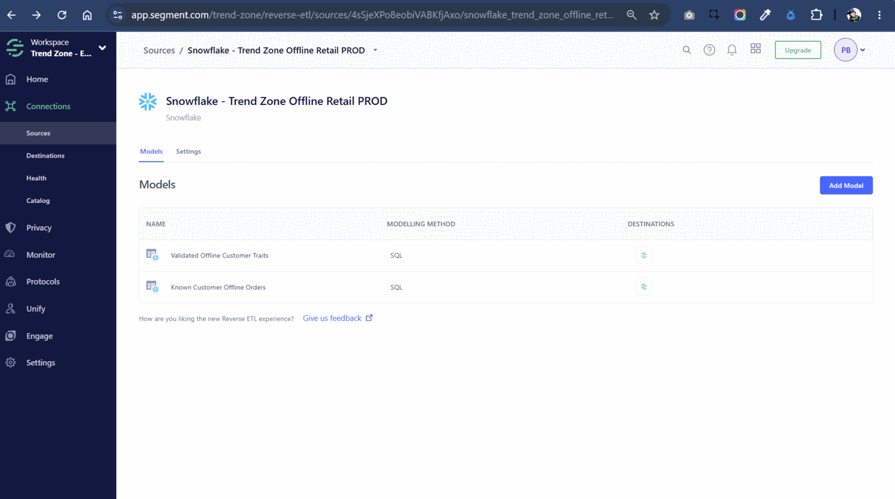

The source settings preserve the implemented connection name before source rotation.

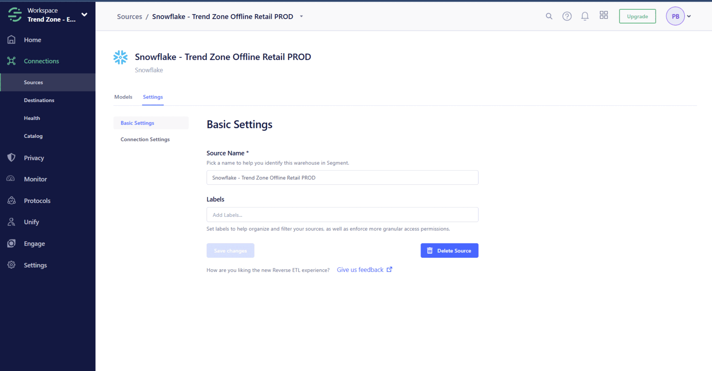

### 2. Secure connection configuration

The connection used the `TREND_ZONE_CDP` database, `TREND_ZONE_WH` warehouse, a dedicated service user and key-pair authentication. The account identifier is redacted and no private key or passphrase is included.

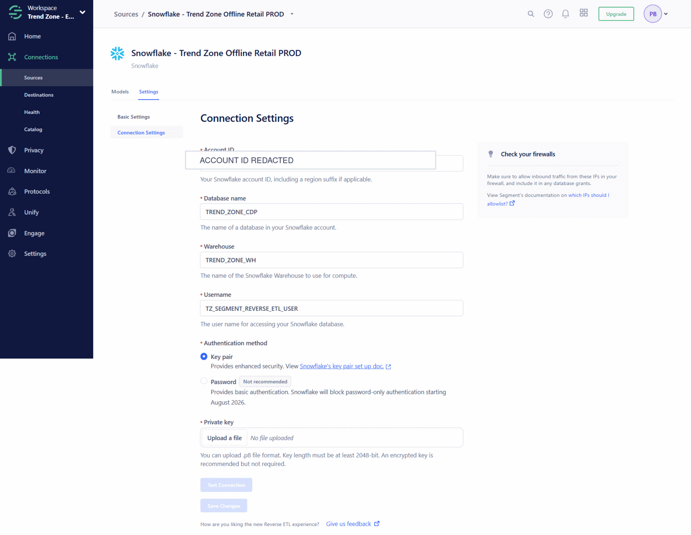

### 3. Physical-store data foundation

Five normalized RAW tables were implemented for customers, stores, products, offline orders and offline order items. The screenshot below shows the Snowflake database objects and the customer-table structure used by the transformations.

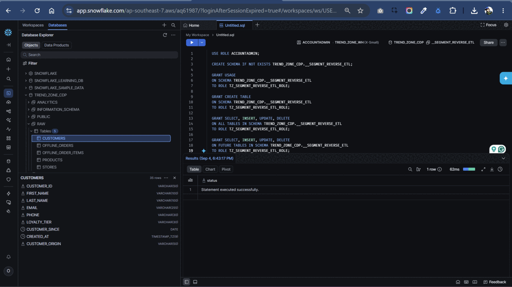

### 4. Segment-ready model previews

The customer-traits model selected five previously validated cross-channel customers and prepared identity, contact, loyalty and offline-purchase traits for Segment Identify calls.

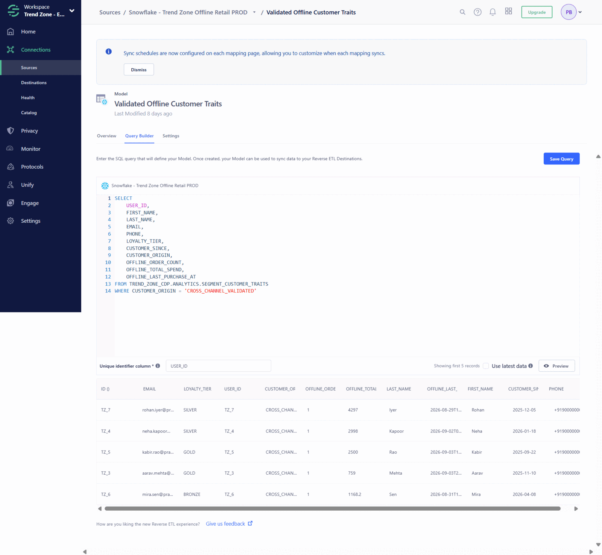

The Identify mapping sends added or updated warehouse records, maps the stable `USER_ID` to Segment `userId`, and places customer attributes and calculated offline metrics under `traits`. It does not manufacture an `anonymousId` for known warehouse customers.

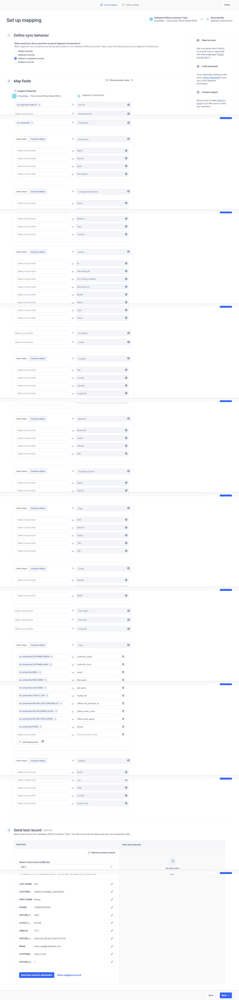

The mapping remained enabled on a daily 8:00 PM IST schedule. The September 4 run extracted five cross-channel customer records and loaded 100%. Later successful runs correctly extracted no records because no mapped rows had been added or updated.

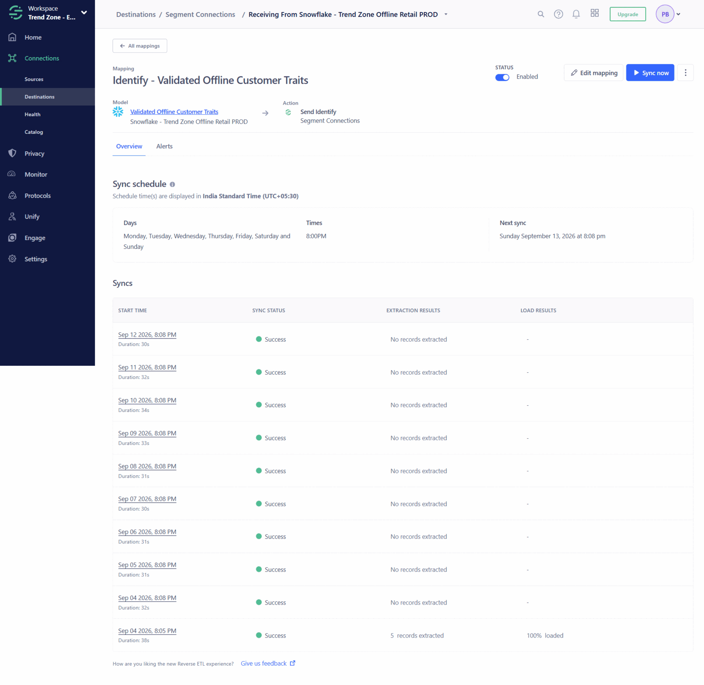

The known-customer order model prepared one Track-ready row per offline transaction, including event time, order value, store attributes and a products array.

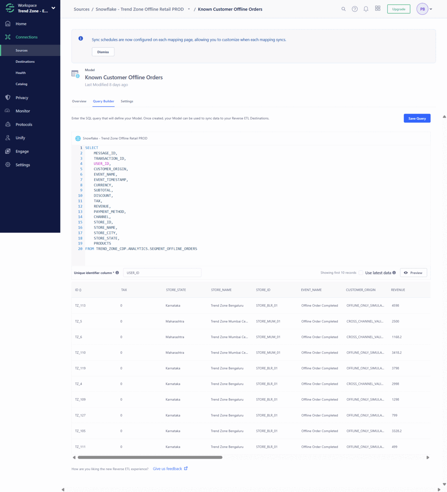

### 5. Payload and schema validation

A representative `Offline Order Completed` event arrived in the Segment Source Debugger with the expected stable `userId`, offline-store channel, transaction reference, product array and reconciled financial values. Segment marked the event as allowed.

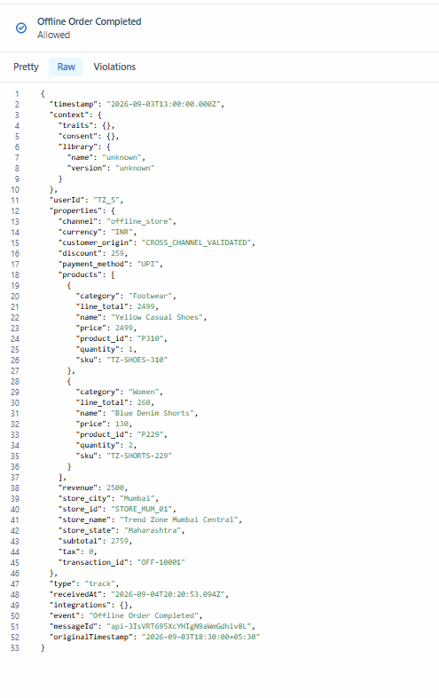

The Identify schema recorded the Snowflake-enriched customer traits, including loyalty tier and offline purchase metrics.

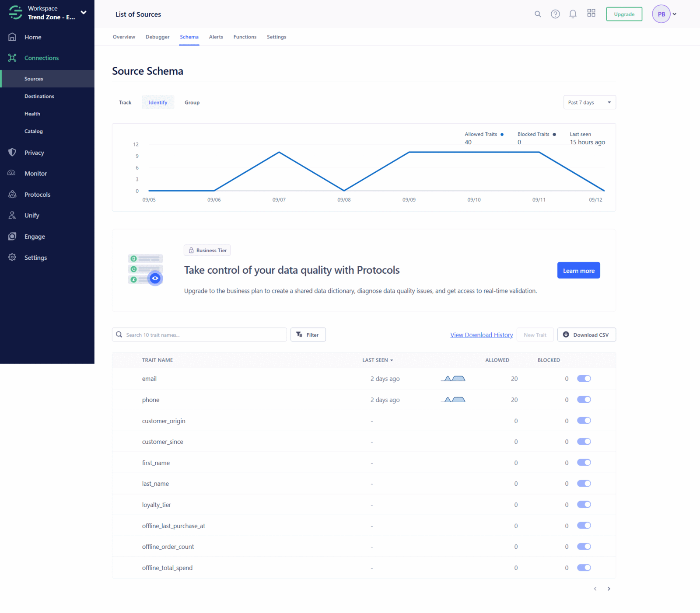

Because the free-plan implementation reused the existing Website source Write Key as the Tracking API endpoint, offline and ecommerce Track event names appear in the same source schema. This is evidence of the documented workaround, not the recommended production topology.

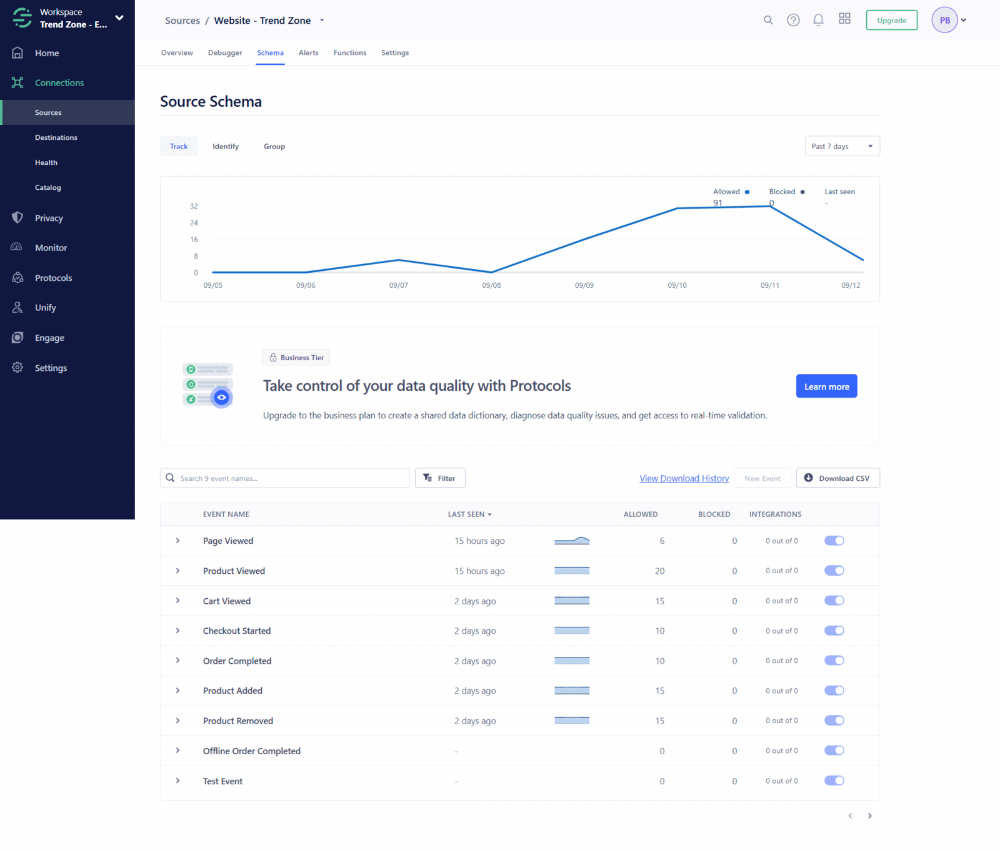

### 6. Customer 360 interpretation

The following illustration communicates the intended Customer 360 outcome for the fictional customer Mira Sen. It is a conceptual portfolio visual—not an exported Segment profile screenshot. The actual implementation evidence is provided by the matching stable identity, delivered traits and allowed event payloads above.

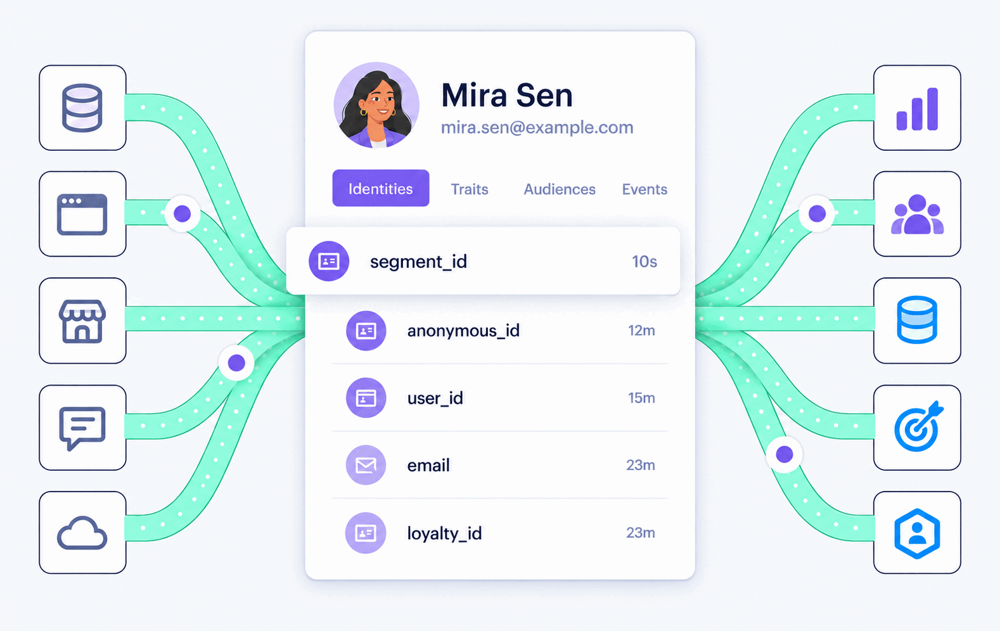

### 7. Pre-delivery mapping validation

Segment's mapped-record preview confirmed that the warehouse row was transformed into the expected event structure before delivery, including `user_id`, timestamp, event name and nested properties.

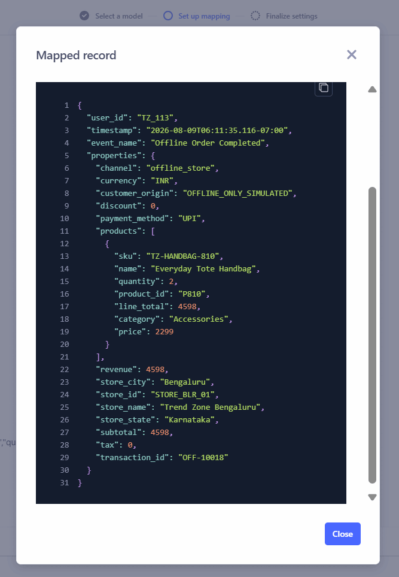
