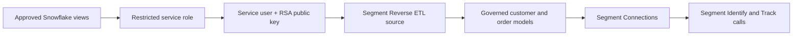

# Secure Snowflake-to-Segment Reverse ETL Tutorial

This tutorial documents the reusable setup used to connect the Trend Zone Snowflake warehouse to Twilio Segment Reverse ETL with a dedicated service user, least-privilege role, and encrypted RSA key pair.

It is written as an implementation reference for future projects. Replace all example object names with environment-specific values and never commit private keys, passphrases, Write Keys, or production customer data.

## What this implementation builds



The private key remains with the client that authenticates to Snowflake. Snowflake stores only the public key. The service role can read approved analytical views and write only to Segment's state-tracking schema.

## Prerequisites

- Snowflake access that can create users, roles, schemas, and grants
- A warehouse and database containing approved analytical views
- Twilio Segment Reverse ETL access
- Git Bash or another terminal with OpenSSL
- A secure password manager for the private-key passphrase

The Trend Zone example uses:

| Component | Example |
|---|---|
| Database | `TREND_ZONE_CDP` |
| Warehouse | `TREND_ZONE_WH` |
| Read schema | `ANALYTICS` |
| Role | `TZ_SEGMENT_REVERSE_ETL_ROLE` |
| Service user | `TZ_SEGMENT_REVERSE_ETL_USER` |
| Segment state schema | `__SEGMENT_REVERSE_ETL` |

## 1. Create the restricted Snowflake role and service user

Run the reusable script [`sql/07-configure-segment-reverse-etl-access.sql`](sql/07-configure-segment-reverse-etl-access.sql) as `ACCOUNTADMIN` or an appropriately delegated security administrator.

The role receives:

| Object | Permission | Reason |
|---|---|---|
| `TREND_ZONE_WH` | USAGE | Execute extraction queries |
| `TREND_ZONE_CDP` | USAGE | Reach the configured database |
| `ANALYTICS` | USAGE | Reach approved analytical views |
| Two approved views | SELECT | Extract customer traits and known offline orders |
| `__SEGMENT_REVERSE_ETL` | USAGE, CREATE TABLE, table DML | Maintain Segment checkpoint tables |
| `RAW` | None | Prevent direct access to ingestion tables |

The service user uses `TYPE = SERVICE`, has no password-based workflow, and receives the restricted role as its default role.

## 2. Generate an encrypted RSA key pair with Git Bash

Open Git Bash and confirm OpenSSL is available:

```bash
openssl version
```

Create a local directory outside the repository:

```bash
mkdir -p ~/trend-zone-secrets
cd ~/trend-zone-secrets
```

Generate a 2048-bit RSA private key and convert it to encrypted PKCS#8 format:

```bash
openssl genrsa 2048 | openssl pkcs8 -topk8 -v2 aes-256-cbc -out trend_zone_segment_key.p8
```

Enter a strong passphrase when prompted and store it in a password manager. The passphrase is not displayed while typing.

Create the public key from the encrypted private key:

```bash
openssl pkey -in trend_zone_segment_key.p8 -pubout -out trend_zone_segment_key.pub
```

Confirm that both files exist:

```bash
ls -l
```

Expected files:

```text
trend_zone_segment_key.p8
trend_zone_segment_key.pub
```

### What each file does

| File | Purpose | May be shared? |
|---|---|---|
| `trend_zone_segment_key.p8` | Encrypted private key used by Segment to authenticate | No |
| `trend_zone_segment_key.pub` | Public key assigned to the Snowflake service user | Yes, when required |
| Passphrase | Decrypts the private key | No |

Never upload the `.p8` file to GitHub, attach it to tickets, paste it into chat, or include it in screenshots.

## 3. Format and assign the public key to Snowflake

Copy only the public-key body to the Windows clipboard:

```bash
grep -v "PUBLIC KEY" trend_zone_segment_key.pub | tr -d '\r\n' | clip
```

Assign that value to the service user:

```sql
USE ROLE ACCOUNTADMIN;

ALTER USER TZ_SEGMENT_REVERSE_ETL_USER
SET RSA_PUBLIC_KEY = '<PASTE_PUBLIC_KEY_BODY_HERE>';
```

Do not include the `BEGIN PUBLIC KEY` and `END PUBLIC KEY` lines in `RSA_PUBLIC_KEY`.

Verify the key fingerprint:

```sql
DESC USER TZ_SEGMENT_REVERSE_ETL_USER;
```

Confirm that `RSA_PUBLIC_KEY_FP` contains a `SHA256:` fingerprint. A fingerprint proves that Snowflake has a public key; it does not expose the private key.

## 4. Verify the service-user role

```sql
SHOW GRANTS TO USER TZ_SEGMENT_REVERSE_ETL_USER;
SHOW GRANTS TO ROLE TZ_SEGMENT_REVERSE_ETL_ROLE;
```

Confirm that the user has the dedicated role, the role can read only the approved views, and it has no access to `RAW`.

Set the defaults because the Segment connection form may not expose a role field:

```sql
ALTER USER TZ_SEGMENT_REVERSE_ETL_USER SET
    DEFAULT_ROLE = TZ_SEGMENT_REVERSE_ETL_ROLE
    DEFAULT_WAREHOUSE = TREND_ZONE_WH;
```

## 5. Create the Segment Reverse ETL source

In Segment, navigate to **Connections → Sources → Reverse ETL → Add Reverse ETL source**, select Snowflake, and configure:

| Segment field | Trend Zone value |
|---|---|
| Source name | `Snowflake - Trend Zone Offline Retail PROD` |
| Account ID | Organization-account identifier for the Snowflake account |
| Database | `TREND_ZONE_CDP` |
| Warehouse | `TREND_ZONE_WH` |
| Username | `TZ_SEGMENT_REVERSE_ETL_USER` |
| Authentication | Key pair |
| Private key | Upload `trend_zone_segment_key.p8` from the local secrets directory |
| Passphrase | Enter the private-key passphrase directly in Segment |

The private key and passphrase belong in Segment's encrypted connection settings only. They must not be stored in repository files.

### Fixing the managed-schema permission error

If authentication succeeds but Segment reports that it cannot use `__segment_reverse_etl`, create and grant the dedicated state schema:

```sql
USE ROLE ACCOUNTADMIN;

CREATE SCHEMA IF NOT EXISTS TREND_ZONE_CDP.__SEGMENT_REVERSE_ETL;

GRANT USAGE, CREATE TABLE
ON SCHEMA TREND_ZONE_CDP.__SEGMENT_REVERSE_ETL
TO ROLE TZ_SEGMENT_REVERSE_ETL_ROLE;

GRANT SELECT, INSERT, UPDATE, DELETE
ON ALL TABLES IN SCHEMA TREND_ZONE_CDP.__SEGMENT_REVERSE_ETL
TO ROLE TZ_SEGMENT_REVERSE_ETL_ROLE;

GRANT SELECT, INSERT, UPDATE, DELETE
ON FUTURE TABLES IN SCHEMA TREND_ZONE_CDP.__SEGMENT_REVERSE_ETL
TO ROLE TZ_SEGMENT_REVERSE_ETL_ROLE;
```

Segment uses this schema to compare model results between syncs. Write access is isolated here; the approved analytical views remain read-only.

## 6. Create the validated customer-traits model

Create a SQL Editor model named `Validated Offline Customer Traits` with `USER_ID` as the unique identifier:

```sql
SELECT
    USER_ID,
    FIRST_NAME,
    LAST_NAME,
    EMAIL,
    PHONE,
    LOYALTY_TIER,
    CUSTOMER_SINCE,
    CUSTOMER_ORIGIN,
    OFFLINE_ORDER_COUNT,
    OFFLINE_TOTAL_SPEND,
    OFFLINE_LAST_PURCHASE_AT
FROM TREND_ZONE_CDP.ANALYTICS.SEGMENT_CUSTOMER_TRAITS
WHERE CUSTOMER_ORIGIN = 'CROSS_CHANNEL_VALIDATED'
```

Do not add a trailing semicolon in the Segment SQL editor. The Trend Zone preview returns five validated customers: `TZ_3` through `TZ_7`.

## 7. Free-plan source-limit workaround

The ideal production design uses a dedicated HTTP API source to receive calls from the Segment Connections destination. The Segment Free workspace used for this portfolio had no remaining source slot.

The implemented workaround reuses the existing `Website - Trend Zone` source Write Key:

```text
Snowflake Reverse ETL model
        → Segment Connections destination
        → Existing website-source Tracking API endpoint
        → Identify call in the Segment Source Debugger
```

This is acceptable for a controlled learning environment because the same stable `userId` contract is used, but it mixes web and warehouse-originated calls in one source debugger.

| Environment | Recommended design |
|---|---|
| Portfolio/free plan | Reuse the existing website source Write Key and document the constraint |
| Production | Create a dedicated HTTP API source for independent ownership, observability, controls, and usage reporting |

Never commit a Segment Write Key or show it unredacted in public screenshots. Browser-source Write Keys are visible client-side by design, but redaction reduces misuse and noisy event injection.

## 8. Configure the Identify mapping

Create a Segment Connections destination named `Segment Connections - Offline Customer Enrichment`, select the existing website source Write Key, and create a `Send Identify` mapping.

Use **Added or updated records** so the first run sends newly extracted rows and later runs send changed traits.

| Model field | Identify field |
|---|---|
| `USER_ID` | User ID |
| None | Anonymous ID |
| Sync-generated time | Timestamp |
| `FIRST_NAME` | `traits.first_name` |
| `LAST_NAME` | `traits.last_name` |
| `EMAIL` | `traits.email` |
| `PHONE` | `traits.phone` |
| `LOYALTY_TIER` | `traits.loyalty_tier` |
| `CUSTOMER_SINCE` | `traits.customer_since` |
| `CUSTOMER_ORIGIN` | `traits.customer_origin` |
| `OFFLINE_ORDER_COUNT` | `traits.offline_order_count` |
| `OFFLINE_TOTAL_SPEND` | `traits.offline_total_spend` |
| `OFFLINE_LAST_PURCHASE_AT` | `traits.offline_last_purchase_at` |

Do not copy `USER_ID` into Anonymous ID. An anonymous ID represents a browser or device before identification; inventing one from the known customer ID can create a false identity association.

## 9. Test before enabling the schedule

Send one test record and confirm in the receiving Source Debugger:

- Call type is `identify`
- `userId` matches the Snowflake `USER_ID`
- `anonymousId` is absent
- Customer attributes are inside `traits`
- Order count and spend remain numeric
- No protocol violations are reported

After the test succeeds, save and enable the mapping, enable the destination, and choose an appropriate schedule. Trend Zone uses a daily 8:00 PM IST batch because offline enrichment does not require real-time extraction.

## 10. Validate the scheduled sync

For the initial Trend Zone model run, the expected result is:

The first scheduled run completed successfully on September 4, 2026.

| Metric | Result |
|---|---:|
| Identify calls observed | 5 |
| Expected user IDs received | 5 of 5 |
| User IDs | `TZ_3`, `TZ_4`, `TZ_5`, `TZ_6`, `TZ_7` |
| Debugger acceptance | All five calls accepted |

The calls arrived together at approximately 8:05 PM IST, confirming that the daily batch schedule, customer filter, identity mapping and Segment Connections delivery path worked end to end.

## 11. Configure the Offline Order Completed Track mapping

Create a second SQL Editor model named `Known Customer Offline Orders` from `TREND_ZONE_CDP.ANALYTICS.SEGMENT_OFFLINE_ORDERS`. Use `MESSAGE_ID` as the model's unique identifier and retain only known-customer rows exposed by the governed view.

Create a `Send Track` mapping with the following top-level fields:

| Model field | Track field |
|---|---|
| `USER_ID` | User ID |
| `EVENT_TIMESTAMP` | Timestamp |
| `EVENT_NAME` | Event Name |

Leave Anonymous ID empty. Choose **Added records** because a completed offline purchase is a historical fact and normal model updates should not resend it.

Map the transaction, financial, store, channel and product data under lowercase `properties`. Remove duplicate copies of `USER_ID`, `EVENT_NAME`, `EVENT_TIMESTAMP`, and `MESSAGE_ID` from properties. Keep `transaction_id` for business traceability.

## 12. Validate the Track payload and scheduled run

First send one representative test order and confirm:

- Type is `track` and event is `Offline Order Completed`.
- `userId` is populated and `anonymousId` is absent.
- Timestamp is valid ISO-8601 and converts correctly to UTC.
- Currency, subtotal, discount, tax and revenue reconcile.
- Every product line retains product ID, SKU, name, category, quantity, price and line total.
- Segment reports the event as Allowed with no protocol violations.

The final scheduled validation completed on September 5, 2026: 35 records were extracted, 100% were loaded and the run completed in 29 seconds.

> **Message-ID note:** The Snowflake model uses `MESSAGE_ID` for Reverse ETL checkpointing, but this destination mapping did not expose a top-level `messageId`. Segment therefore generated the Tracking API message ID. Preserve `properties.transaction_id` and use downstream idempotency for production replays.

## Free-plan source retirement

After evidence and documentation are safely committed, disable the mappings and destination, delete the Segment Snowflake source to release the free-plan slot, and disable the Snowflake service user. Retain the governed Snowflake objects and SQL package so the implementation can be restored without rebuilding the data model.

## Key rotation for a live project

Use Snowflake's secondary public-key slot to rotate without downtime:

1. Generate a new encrypted private/public key pair.
2. Assign the new public key to `RSA_PUBLIC_KEY_2`.
3. Update and test the client with the new private key.
4. Promote or retain the new key according to the operating procedure.
5. Remove the old public key only after all clients have migrated.

Never overwrite the only working key before the replacement has been tested. Store ownership, rotation date, expiry policy, and emergency-revocation steps in the organization's secrets-management runbook.

## Troubleshooting reference

| Symptom | Likely cause | Resolution |
|---|---|---|
| `openssl: command not found` | OpenSSL is unavailable | Use Git Bash with OpenSSL or install an approved OpenSSL distribution |
| `No such file or directory` after `cd` | Directory was misspelled or created at another path | Run `pwd` and `ls`, then create and enter the exact directory |
| Strange `^[[200~` text before a command | Terminal bracketed-paste control characters were included | Cancel the line and type/paste the command again cleanly |
| Private-key passphrase rejected | Wrong passphrase or wrong `.p8` file | Verify locally with `openssl pkey -in <file> -check` without exposing the passphrase |
| Snowflake authentication fails | Public key does not match the uploaded private key | Compare the derived public key and Snowflake fingerprint; reassign the correct public key |
| Connected but cannot use `__SEGMENT_REVERSE_ETL` | Missing managed-schema permissions | Create the schema and apply the isolated grants in Step 5 |
| Initial sync sends zero records | Mapping is configured for updated records only | Select **Added or updated records** |
| Incorrect identity association | Known `USER_ID` was also mapped as Anonymous ID | Remove the Anonymous ID mapping |
| Destination list is empty | No Reverse ETL destination is connected to the warehouse source | Add Segment Connections or another supported destination |

## Security checklist

- [ ] Private key is encrypted and stored outside the repository
- [ ] Passphrase is stored in an approved password manager or secrets vault
- [ ] Snowflake stores only the public key
- [ ] Dedicated `TYPE = SERVICE` user is used
- [ ] Default role and warehouse are explicitly set
- [ ] Role has no `RAW` schema access
- [ ] SELECT is limited to approved views
- [ ] Write access is limited to `__SEGMENT_REVERSE_ETL`
- [ ] Write Keys and customer details are redacted from public screenshots
- [ ] Identify payload contains `userId` and no fabricated `anonymousId`
- [ ] Track payload contains `Offline Order Completed`, reconciled totals and complete `products[]`
- [ ] Scheduled Track run shows 35 extracted and 100% loaded
- [ ] Rotation and revocation procedures are documented for production
