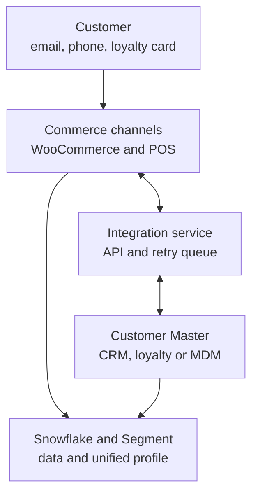
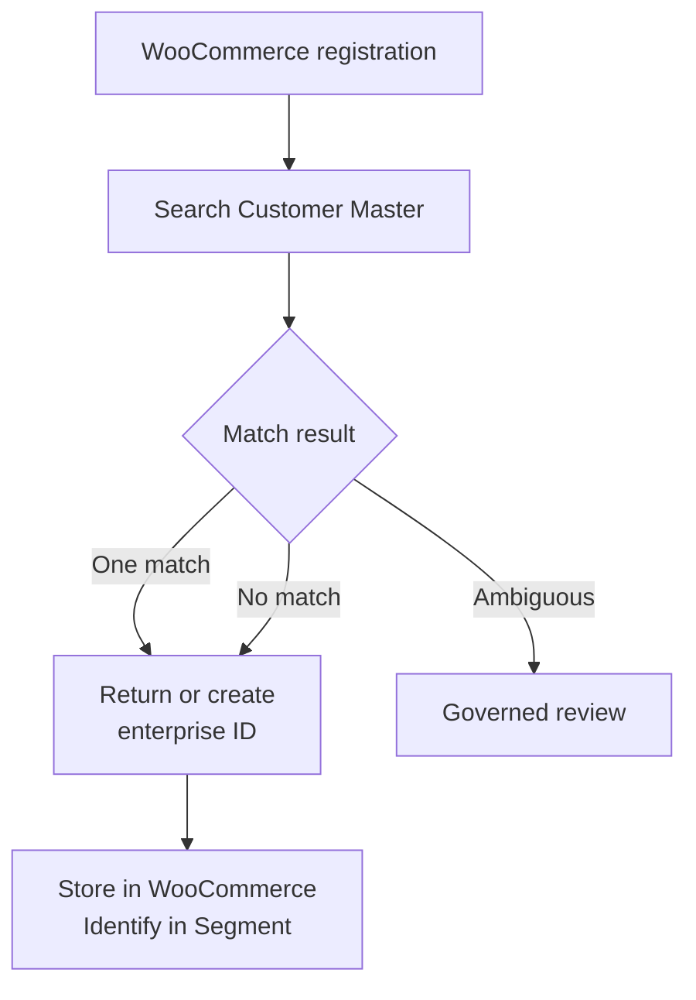

# Trend Zone Cross-Channel Identity Resolution

## Objective

This document defines how Trend Zone connects anonymous ecommerce behaviour and known WooCommerce, offline-store and simulated marketplace activity in Twilio Segment, including the validated Sprint 3 identity contract.

The goal is to preserve the anonymous browser identity generated by Segment and introduce a stable first-party customer identifier when the visitor becomes known.

> **Portfolio note:** All identifiers and customer values shown in this document are illustrative. Real test emails, full anonymous IDs, and other personally identifiable information are intentionally excluded.

---

## Identity Strategy

Trend Zone uses the following identity model:

| Identity field | Source | Purpose |
|---|---|---|
| `anonymousId` | Segment Analytics.js | Identifies the browser before the customer is known |
| `userId` | WordPress/WooCommerce user ID with `TZ_` prefix | Stable first-party identifier for a known customer |
| `email` | WooCommerce/WordPress customer profile | Customer trait |
| `phone` | WooCommerce billing profile | Optional customer trait |

Example mapping:

```text
WordPress / WooCommerce user ID: 123
                ↓
Trend Zone customer ID: TZ_123
                ↓
Segment userId: TZ_123
```

Email is deliberately treated as a trait rather than the primary customer identifier.

Segment remains responsible for generating and maintaining `anonymousId`; Trend Zone does not create a separate custom anonymous identifier.

---

## Architecture


The architecture above shows the complete identity flow from a logged-in WooCommerce customer through the WordPress identity snippet, Google Tag Manager, and the `analytics.identify()` call into Twilio Segment.

The identity implementation is intentionally separated from behavioural ecommerce events such as `Product Viewed`.

---

## WordPress / WooCommerce Identity Signal

A WordPress PHP snippet retrieves the currently authenticated user and exposes the required identity fields to the browser data layer.

The customer identifier is derived from the WordPress/WooCommerce user ID:

```php
$customer_id = 'TZ_' . $user_id;
```

The implementation only runs for authenticated users. Anonymous visitors therefore continue to be represented only by Segment's `anonymousId`.

### Session-level duplicate suppression

The final implementation uses browser `sessionStorage` to avoid generating a redundant Identify call on every logged-in page view.

```php
add_action( 'wp_footer', function () {

    if ( ! is_user_logged_in() ) {
        return;
    }

    $user_id = get_current_user_id();
    $user    = wp_get_current_user();

    $customer_id = 'TZ_' . $user_id;
    $email       = $user->user_email;
    $phone       = get_user_meta( $user_id, 'billing_phone', true );
    ?>

    <script>
    (function () {

        var customerId = <?php echo wp_json_encode( $customer_id ); ?>;
        var identifiedCustomer =
            sessionStorage.getItem('trendzone_identified_customer');

        if (identifiedCustomer === customerId) {
            return;
        }

        window.dataLayer = window.dataLayer || [];

        window.dataLayer.push({
            event: 'user_identified',
            user: {
                customer_id: customerId,
                email: <?php echo wp_json_encode( $email ); ?>,
                phone: <?php echo wp_json_encode( $phone ); ?>
            }
        });

        sessionStorage.setItem(
            'trendzone_identified_customer',
            customerId
        );

    })();
    </script>

    <?php
});
```

This is session-level suppression rather than a requirement that Segment Identify must only ever be called once. It prevents unnecessary repeated Identify calls during normal navigation while still allowing identity to be established in a fresh browser-tab session for a customer who is already authenticated.

If a different customer becomes active in the same tab, the stored customer ID no longer matches and the new identity can be sent.

---

## Google Tag Manager Configuration

### Data Layer Variables

Three GTM Data Layer Variables map the nested `user` object:

| GTM Variable | Data Layer key |
|---|---|
| `DLV - Customer ID` | `user.customer_id` |
| `DLV - Customer Email` | `user.email` |
| `DLV - Customer Phone` | `user.phone` |

### Custom Event Trigger

**Trigger:** `CE - user_identified`

```text
Trigger Type: Custom Event
Event name: user_identified
Regex matching: Off
Fires on: All Custom Events
```

### Segment Identify Tag

**Tag:** `SEG - User Identify`

```html
<script>
  window.analytics.identify(
    '{{DLV - Customer ID}}',
    {
      email: '{{DLV - Customer Email}}',
      phone: '{{DLV - Customer Phone}}'
    }
  );
</script>
```

**Trigger:** `CE - user_identified`

The resulting Segment call has the conceptual form:

```javascript
analytics.identify('TZ_123', {
  email: 'customer@example.com',
  phone: '+10000000000'
});
```

Phone is optional and may be empty when the customer has not supplied billing phone information.

---

## Offline-Store Customer Recognition

> **Sprint 2 status: completed.** Secure Reverse ETL connectivity, the scheduled five-customer Identify batch and the 35-order Track batch are validated. Known offline orders use the same governed `userId` contract as WooCommerce; unidentified guest orders remain excluded from profile activation.

### What POS means

**POS** stands for **Point of Sale**. It is the system used at a physical-store checkout counter to scan products, calculate the bill, accept payment, issue a receipt, and record the transaction.

A POS system can also look up a registered customer before completing the sale.

### How a physical store recognizes a known customer

The salesperson and customer do not need to know Trend Zone's internal customer ID, such as `TZ_5`. At checkout, the customer provides a recognizable identifier, such as:

- Registered mobile number
- Registered email address
- Loyalty-card barcode
- Trend Zone application QR code
- Membership number

The POS uses that value to search the customer master. If a matching account exists, the POS retrieves the internal customer ID in the background and attaches it to the transaction.

```text
Customer provides phone, email, loyalty card or application QR code
                              ↓
                    POS searches customer master
                              ↓
                    Registered customer found
                              ↓
                Internal customer ID returned: TZ_5
                              ↓
                 POS attaches TZ_5 to the purchase
                              ↓
                  Transaction loads into Snowflake
                              ↓
          Snowflake customer_id maps to Segment userId
```

The salesperson may see only customer-facing information such as membership status, loyalty tier, or available points. The internal technical identifier does not need to be displayed.

### Shared identifier across online and offline activity

For a recognized customer, the same stable first-party identifier is used across the systems:

| System | Field | Example |
|---|---|---|
| WooCommerce | `customer_id` | `TZ_5` |
| Physical-store POS | Internal customer reference | `TZ_5` |
| Snowflake | `customer_id` | `TZ_5` |
| Twilio Segment | `userId` | `TZ_5` |

For example, an offline order can be stored as:

```text
transaction_id = OFF-10001
customer_id    = TZ_5
channel        = offline_store
revenue        = 2500
currency       = INR
```

When this record is mapped through Reverse ETL, Snowflake's `customer_id` becomes Segment's `userId`. Because WooCommerce already identifies the same customer with `userId = TZ_5`, Segment can associate online behaviour and the offline purchase with the same known customer.

### What happens when the customer is not identified

A customer may decline to provide an identifier, or the provided phone number or email may not match an existing account. In that case, Trend Zone must not guess the identity or forcibly associate the sale with a known profile.

The purchase is recorded as a guest transaction:

```text
transaction_id = OFF-10003
customer_id    = NULL
channel        = offline_store
```

The transaction can remain unassociated unless the customer later supplies a reliable linking signal—for example, by claiming loyalty points, requesting an electronic receipt through a registered account, scanning the application, or associating the receipt with an online account.

### Responsibility of each layer

| Layer | Responsibility |
|---|---|
| Customer interaction | Supplies a recognizable identifier voluntarily |
| POS | Looks up the customer and attaches the internal customer ID |
| Customer master | Maintains the relationship between phone/email/loyalty credentials and customer ID |
| Snowflake | Stores and models the resulting offline transaction |
| Segment | Uses the supplied stable identifier to associate activity with a customer profile |

Snowflake does not independently discover that a shopper is `TZ_5`, and Segment should not infer a match without a reliable identity signal. Customer recognition happens at collection time in the POS; cross-channel association happens later using the stable identifier in Segment.

---

## Planned Marketplace Identity Contract

> **Sprint 3 status: completed and validated.** The TrendCart marketplace simulation sends Track calls directly from Postman to Segment. Known customer `TC-CUST-006` uses governed `userId = TZ-CUST-006`; marketplace-only customer `TC-CUST-101` uses namespaced `anonymousId = marketplace:trendcart:TC-CUST-101`.

| Scenario | Segment treatment |
|---|---|
| A deterministic crosswalk to an existing Trend Zone customer exists | Use the governed Trend Zone `customer_id` as `userId` |
| A marketplace-only shopper has a stable partner reference | Use a namespaced value such as `marketplace:trendcart:TC-CUST-101` as `anonymousId` |
| No reliable customer reference exists | Reject or quarantine from customer-level delivery; do not infer a match |

The source field `marketplace_customer_ref` remains a partner identifier and must not automatically become a Trend Zone `userId`. Email or phone may support a governed crosswalk in a later identity-resolution phase, but they will not be used for silent or speculative matching during Sprint 3.

## Portfolio Scope and Enterprise Implementation

### Implemented portfolio approach

Trend Zone deliberately uses a simplified stable-ID strategy:

```text
WooCommerce user 5 → customer_id TZ_5 → Segment userId TZ_5
Offline order      → customer_id TZ_5 → Segment userId TZ_5
```

For the simulated offline-store dataset, the project assumes that the POS has already recognized the customer and attached `TZ_5` before the transaction reaches Snowflake. This is sufficient to implement and validate the principal CDP requirement: online and offline activity can be associated when both sources supply the same stable identifier.

The project does **not** claim that a production POS, central Customer Master, or live Salesforce lookup was implemented.

### Why this boundary was chosen

A complete Customer Master implementation would require an operational CRM, loyalty platform, MDM service, or customer API in addition to secure integration code, duplicate-management rules, retry processing, monitoring, consent controls, and identifier migration. That would expand the project from CDP implementation into a separate MDM and application-integration programme.

The portfolio therefore implements the ingestion, transformation, stable-ID mapping, and CDP association layers while documenting the production design below.

### Production-grade enterprise architecture

In a larger retailer, a central Customer Master would own the enterprise customer ID. WooCommerce and the physical-store POS would consume that ID rather than create unrelated identifiers.



Salesforce CRM could serve as the operational Customer Master. Snowflake would remain the analytical warehouse, and Segment would remain the profile-association and activation layer.

### Production online-registration process

1. The customer submits registration details to the WooCommerce backend.
2. WooCommerce validates the request.
3. Server-side integration code sends normalized email, phone, consent, and the WooCommerce source ID to the Customer Master.
4. The Customer Master searches for an existing verified customer.
5. One unambiguous match returns the existing enterprise customer ID.
6. No match creates a customer and a new enterprise ID.
7. Conflicting matches enter governed duplicate review; they are not forcibly merged.
8. WooCommerce stores the returned enterprise ID in protected user metadata.
9. The data layer exposes the ID when the customer becomes known.
10. GTM maps it to Segment's `userId` through an Identify call.



Customer Master credentials remain server-side and never appear in browser JavaScript, the data layer, GTM variables, or repository documentation.

### Production offline-checkout process

At checkout, a customer may provide a phone number, email, loyalty card, membership number, or application QR code. The POS sends that recognizable identifier through the integration service. The Customer Master returns the enterprise ID, which the POS attaches to the transaction before it is loaded into Snowflake.

```text
Customer supplies identifier
        ↓
POS requests Customer Master lookup
        ↓
Enterprise customer ID returned
        ↓
POS attaches ID to transaction
        ↓
Snowflake models transaction
        ↓
Reverse ETL maps ID to Segment userId
```

If no reliable customer is found, the order keeps a null customer ID and is not attached to a known Segment profile.

### Availability, retries, and governance

A production journey should not necessarily fail because the CRM is temporarily unavailable. A robust hybrid design attempts the lookup immediately and queues unsuccessful synchronization requests for secure background retry.

```text
Lookup succeeds  → Store enterprise ID
Service fails    → Continue permitted journey → Queue retry
Match ambiguous  → Do not merge → Governed review
```

Verified matching signals, duplicate rules, audit history, consent, role-based access, monitoring, reconciliation, and reversible merges would be required in production.

### Portfolio versus production

| Concern | Portfolio | Production |
|---|---|---|
| ID authority | Controlled WooCommerce-derived ID | CRM, loyalty, MDM, or identity service |
| Online lookup | Not implemented | Secure server-side API |
| Offline recognition | Simulated as completed by POS | Live POS-to-Customer-Master lookup |
| Failure handling | Documented assumption | Timeouts, retries, monitoring, reconciliation |
| Duplicate management | Controlled fictional records | Verified matching and governed review |
| Snowflake | Offline warehouse and modeling | Analytical copy of operational data |
| Segment | Associates events sharing `userId` | Governed profile unification and activation |

> **Architectural principle:** Customer recognition must occur through a trustworthy source-system or Customer Master process. Snowflake models the resulting records, and Segment associates cross-channel activity using the governed stable identifier. Neither should guess an identity without a reliable signal.

---

## Validation

The implementation was validated incrementally through GTM Preview and the Twilio Segment Source Debugger.

### Test 1 — Anonymous product behaviour

A clean browser session visited a product before authentication.

Expected and observed identity state:

```text
Product Viewed
anonymousId = <Segment-generated anonymous ID>
userId      = null
```

This confirmed that anonymous ecommerce behaviour was being collected without prematurely assigning a known customer ID.

### Test 2 — Anonymous to known transition

The same browser session then logged into a WooCommerce test customer account.

The `user_identified` event triggered `analytics.identify()`.

Expected and observed state:

```text
Before login
anonymousId = A
userId      = null

       ↓ login / identify

After Identify
anonymousId = A
userId      = TZ_123
```

The important validation was that the `anonymousId` remained unchanged while the stable `userId` was introduced.

### Test 3 — Behaviour after identification

The authenticated customer then viewed another product in the same browser session.

Expected and observed state:

```text
Product Viewed
anonymousId = A
userId      = TZ_123
```

This demonstrated that subsequent ecommerce behaviour carried the known customer identity while retaining the same anonymous browser identifier.

### Test 4 — Duplicate Identify suppression

The customer navigated through additional pages and product views after identification.

The final implementation produced one Identify event for the customer in the browser-tab session and did not generate a new Identify call on every page load.

Subsequent behavioural events continued to contain the established `userId`.

---

## Validated Customer Journey

```text
ANONYMOUS VISITOR
anonymousId = A
userId      = null
       │
       │ Product Viewed
       ▼
CUSTOMER LOGIN
       │
       │ user_identified
       │ analytics.identify("TZ_123")
       ▼
KNOWN CUSTOMER
anonymousId = A
userId      = TZ_123
       │
       │ Product Viewed
       ▼
KNOWN BEHAVIOUR
anonymousId = A
userId      = TZ_123
```

---

## Result

The WooCommerce source now demonstrates a working anonymous-to-known customer identity transition:

- Segment generates and maintains the anonymous browser identity.
- WooCommerce/WordPress provides a stable first-party customer identifier when the visitor is authenticated.
- GTM translates the `user_identified` data-layer signal into a Segment Identify call.
- The same Segment `anonymousId` is retained when `userId` is introduced.
- Subsequent ecommerce events carry the known `userId`.
- Session-level suppression prevents unnecessary Identify calls on every logged-in page view.

This provides the identity foundation for later Trend Zone use cases including cart behaviour, checkout, purchase, profile unification, audience creation, and activation.
---

## Sprint 5 Canonical Identity Extension

Sprint 5 standardizes new Customer 360 artifacts on the production-style `TZ-CUST-###` format. Earlier values such as `TZ_123` and `TZ_5` remain historical Sprint 1–2 test identifiers; if reused, they must be connected through an explicit crosswalk rather than silently renamed.

The identity model now includes Salesforce CRM:

| Salesforce object | Identity treatment |
|---|---|
| Contact | `Trend_Zone_Customer_ID__c` supplies the governed canonical customer ID; `Contact.Id` remains source lineage |
| Case | `Trend_Zone_Customer_ID__c` associates service activity with a customer; Case ID remains an activity identifier |

Email, phone and name do not independently authorize a merge. Guest, marketplace-only and ambiguous records remain separate until deterministic evidence exists.

See the [Sprint 5 overview](sprint-5/README.md) and [Day 1 canonical identity contract](sprint-5/day-1-identity-contract.md) for the cross-source schema, precedence rules and acceptance criteria.

