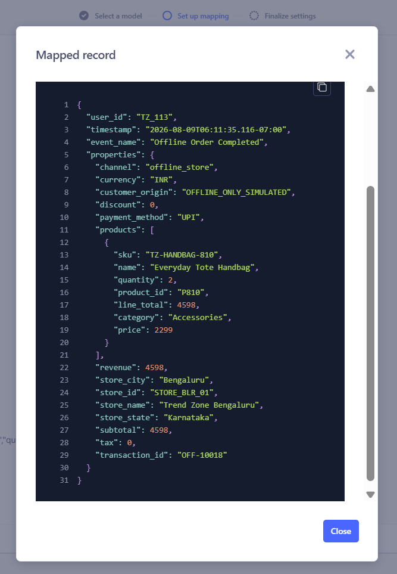
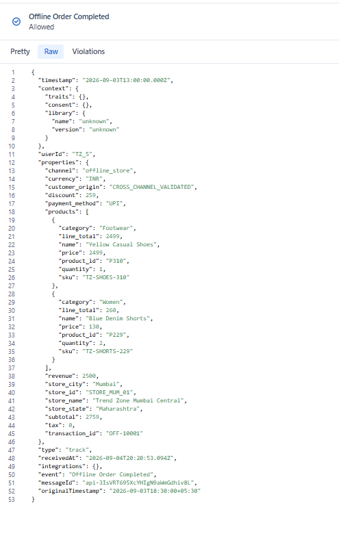
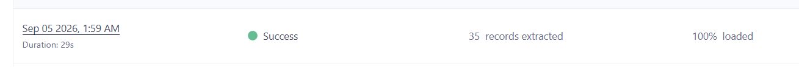

# Sprint 2 Snowflake Reverse ETL Validation

## Final decision

**Sprint 2 QA status: Passed**

The Snowflake offline-store source was implemented and validated end to end through secure Reverse ETL. Both customer enrichment and offline transaction delivery reached Segment successfully.

## Scope

```text
Synthetic POS dataset
      ↓
Snowflake RAW tables
      ↓
Governed ANALYTICS views
      ↓
RSA-authenticated Segment Reverse ETL
      ↓
Segment Connections destination
      ↓
Identify and Track calls in Source Debugger
```

## Acceptance results

| Test | Expected result | Observed result | Status |
|---|---|---|---|
| Raw dataset | 35 customers, 2 stores, 9 products, 50 orders and 63 lines | Counts matched | Passed |
| Data-quality controls | Seven checks return zero | All returned zero | Passed |
| Customer-traits view | 35 known customers | 35 rows | Passed |
| Known-order view | 35 known-customer orders | 35 rows | Passed |
| Guest isolation | 15 guest orders excluded from profile activation | 15 retained only in guest view | Passed |
| RSA authentication | Service user connects without password-only authentication | Connection successful | Passed |
| Least privilege | Read only governed views; isolated checkpoint write access | Connection and extraction successful | Passed |
| Identify test | Stable `userId`, traits and no fabricated `anonymousId` | Allowed Identify payload received | Passed |
| Scheduled Identify | Five cross-channel records delivered together | Five Identify calls observed | Passed |
| Track test | Allowed event with correct identity, timestamp, products and totals | Test event received without violations | Passed |
| Scheduled Track | All 35 known orders delivered | 35 extracted, 100% loaded | Passed |

## Track mapping contract

| Source field | Segment field | Rule |
|---|---|---|
| `USER_ID` | `userId` | Stable known-customer identifier |
| `EVENT_TIMESTAMP` | `timestamp` | Source occurrence time, normalized to UTC |
| `EVENT_NAME` | `event` | `Offline Order Completed` |
| Transaction, value, channel and store columns | `properties` | Lowercase governed property names |
| `PRODUCTS` | `properties.products[]` | Preserve product-level detail |
| Anonymous ID | Not mapped | Warehouse order has no browser session identity |

Delivery is configured for **Added records** so a completed order is emitted when first discovered and is not normally resent when a modeled row changes.



## Representative payload reconciliation

The manual Track test used transaction `OFF-10001` for `TZ_5`:

| Check | Observed value |
|---|---|
| Event | `Offline Order Completed` |
| Channel | `offline_store` |
| Currency | `INR` |
| Products | Yellow Casual Shoes × 1; Blue Denim Shorts × 2 |
| Subtotal | 2,759 |
| Discount | 259 |
| Tax | 0 |
| Revenue | 2,500 |
| Protocol result | Allowed; no violations |

The source time `2026-09-03 18:30:00 +05:30` appeared in Segment as `2026-09-03T13:00:00.000Z`, confirming correct timezone conversion.



## Scheduled-run evidence

The scheduled Track extraction completed on September 5, 2026:

| Metric | Result |
|---|---:|
| Status | Success |
| Records extracted | 35 |
| Loaded | 100% |
| Duration | 29 seconds |
| Reported failures | 0 |



The expected source-debugger total after this run is 36 offline Track calls: one earlier manual test plus 35 scheduled records. The scheduled-run report itself correctly shows 35.

## Known limitation

The model's `MESSAGE_ID` is the Reverse ETL unique identifier, but the Segment Connections Track mapping did not expose a top-level `messageId` field. Segment generated the API message ID. A replay after checkpoint reset could therefore create another event for the same transaction.

Production mitigation should use a deterministic event message ID when supported or downstream idempotency based on `transaction_id`.

## Free-plan validation strategy

The Segment Free workspace limits the number of active sources. The project therefore validates Snowflake, the TrendCart marketplace HTTP API source and Salesforce sequentially rather than claiming simultaneous operation.

Before rotating the Snowflake slot:

- Commit all privacy-reviewed evidence and implementation documents.
- Disable both Reverse ETL mappings and the Segment Connections destination.
- Delete the Snowflake source only after the evidence is secure.
- Disable the Snowflake service user.
- Keep the Snowflake objects, role and SQL package for reproducibility.
- Confirm the WooCommerce source remains healthy.

## Screenshot evidence index

| Evidence | What it demonstrates |
|---|---|
| [Snowflake models overview](../assets/evidence/sprint-2/S2-01a-snowflake-models-overview.png) | Both governed Reverse ETL models configured in the source |
| [Snowflake source settings](../assets/evidence/sprint-2/S2-01b-snowflake-source-settings.png) | Preserved source identity before rotation |
| [Connection configuration](../assets/evidence/sprint-2/S2-02-snowflake-connection-configuration.png) | Database, warehouse, service user and key-pair method; account identifier redacted |
| [Physical-store tables](../assets/evidence/sprint-2/S2-03-physical-store-table.png) | Implemented Snowflake RAW data foundation |
| [Customer-traits preview](../assets/evidence/sprint-2/S2-04a-customer-traits-model-preview.png) | Cross-channel trait selection and stable-ID contract |
| [Identify mapping](../assets/evidence/sprint-2/S2-09-identify-mapping.png) | Stable `USER_ID` mapped to `userId`; traits nested without a fabricated `anonymousId` |
| [Identify sync history](../assets/evidence/sprint-2/S2-10-identify-scheduled-sync.png) | Enabled daily schedule and successful five-record initial load |
| [Offline-orders preview](../assets/evidence/sprint-2/S2-04b-offline-orders-model-preview.png) | Track-ready offline-order transformation |
| [Allowed debugger payload](../assets/evidence/sprint-2/S2-05-segment-source-debugger.png) | Delivered event structure and protocol result |
| [Identify schema](../assets/evidence/sprint-2/S2-06a-segment-identify-schema.png) | Allowed Snowflake-enriched traits |
| [Shared Track schema](../assets/evidence/sprint-2/S2-06b-segment-track-schema.png) | Ecommerce and offline events sharing the free-plan workaround source |
| [Mira Sen conceptual profile](../assets/evidence/sprint-2/S2-07-customer-profile.png) | Intended Customer 360 outcome; explicitly conceptual |
| [Mapped-record preview](../assets/evidence/sprint-2/S2-08-validation-result.png) | Pre-delivery event mapping validation |

The screenshots are explained in context in the [Snowflake offline-store implementation](../03-data-sources/snowflake-offline-store-implementation.md#sprint-2-implementation-evidence).

## Evidence privacy review

The committed screenshots exclude private keys, passphrases, Segment Write Keys and Snowflake credentials. All customer, order, store and product values shown in this project are synthetic portfolio data.
