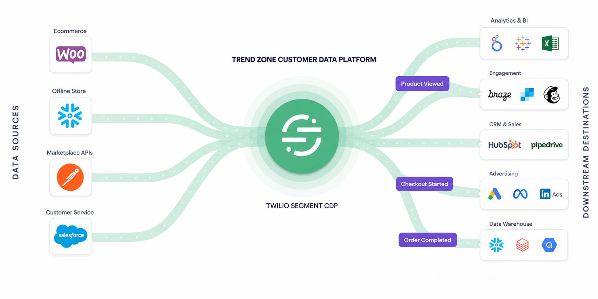
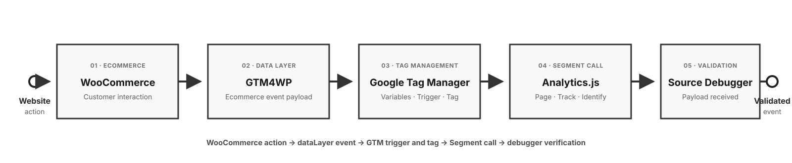

<div align="center">


# Twilio Segment CDP for Ecommerce and Retail

### An end-to-end customer data platform case study for Trend Zone

A hands-on portfolio project demonstrating how ecommerce, transactional, CRM, and external data can be collected, standardized, unified, and activated through **Twilio Segment**.

</div>

---

## Project Status

> **Sprints 1–6 complete:** The four source flows have been implemented and validated within their documented scope. Sprint 5 applied a canonical identity contract to build a reproducible Customer 360 reference implementation and a configuration blueprint for Segment Unify. No licensed Unify activation is claimed.

| Source | Ingestion pattern | Status |
|---|---|---|
| WooCommerce | Real time through GTM and Segment Analytics.js | **Completed and validated** |
| Snowflake | Batch through Snowflake Reverse ETL | **Completed — Identify and Track validated** |
| TrendCart Marketplace (simulated) | Postman → Segment HTTP Tracking API | **Completed — 4 scenarios, 8/8 tests passed** |
| Salesforce CRM | Native cloud-app object sync | **Completed — [Day 3 Case modelling and architecture decision](03-data-sources/salesforce/salesforce-crm-day-3.md)** |

---

## Business Problem

Trend Zone is a fictional ecommerce and retail company whose customer data exists across disconnected systems. Behavioural activity, transactions, customer records and external marketplace data cannot currently provide a consistent view of each customer.

This project demonstrates how a CDP can:

- Collect customer interactions from multiple sources
- Standardize events and customer attributes
- Connect anonymous behaviour with known customers
- Build unified customer profiles
- Define audiences from behavioural and transactional signals
- Activate those audiences in downstream platforms

---

## About the Trend Zone Ecommerce Website

[**Visit the live Trend Zone store →**](https://trendzone.prabirbera.com/)

Trend Zone is a fictional fashion retail brand implemented as a working **WordPress and WooCommerce ecommerce website**. Rather than relying only on sample JSON or diagrams, the site provides a controlled, first-party environment in which real customer journeys can generate observable data for this CDP portfolio.

| Detail | Description |
|---|---|
| Website | [trendzone.prabirbera.com](https://trendzone.prabirbera.com/) |
| Business model | Fashion ecommerce and retail |
| Platform | WordPress and WooCommerce |
| Project role | Real-time digital behavioural and transactional source |
| Data collection | GTM4WP data layer → Google Tag Manager → Twilio Segment |
| Environment | Portfolio and learning environment using test products, customers and orders |

### Customer journeys supported

The website makes it possible to test a realistic ecommerce journey from initial discovery through conversion:

- Browse men's and women's fashion products
- View simple and variable products
- Select product attributes such as colour
- Add products in different quantities
- Build and update a multi-product cart
- Remove products and verify cart-state changes
- Sign in to connect anonymous behaviour with a known customer
- Begin checkout and complete a test order

### Role in the CDP implementation

Trend Zone is the first real-time source in the wider four-source Customer 360 architecture. WooCommerce interactions are exposed through the GTM4WP ecommerce data layer, translated into governed Segment events in Google Tag Manager, and delivered to Twilio Segment as **Page**, **Track** and **Identify** calls.

This makes the website more than a visual storefront: it is the project's live implementation and QA environment for validating event timing, product schemas, customer identity, cart contents, order totals and duplicate prevention.

> **Data disclaimer:** Trend Zone is not a commercial retail operation. The brand, products, customers and orders used in this project are fictional or test data created solely for learning and portfolio demonstration.

---

## Target Architecture

The complete solution is designed around four source systems:

<p align="center">
  
</p>

_Simplified architecture overview. WooCommerce, Snowflake and the TrendCart simulation are completed and validated. The Salesforce CRM native source, governed customer ID, Contact model and Identify mapping are implemented and validated. See the [detailed target architecture](02-architecture/target-architecture.md) for the full source, identity, CDP-capability and destination design._

1. **WooCommerce** — real-time browsing, cart, checkout, purchase and identity events
2. **Snowflake** — batch customer and transaction data
3. **TrendCart Marketplace (simulated)** — Postman-generated Track calls sent directly to a dedicated Segment HTTP API source
4. **Salesforce CRM** — customer and service context

Twilio Segment provides the central collection, identity, profile, audience and activation layer.

---

## Delivery Approach

This portfolio is managed as a small product implementation rather than a collection of disconnected technical exercises. The work is divided into **one-week, outcome-based sprints**, with each sprint moving one source or CDP capability through discovery, design, implementation, validation and documentation.

### Why the work is divided into sprints

Each source has different data structures, identity signals, ingestion patterns and validation requirements. Completing one bounded capability at a time makes it possible to:

- Prioritize the highest-value customer-data problem
- Define a clear scope and measurable sprint goal
- Validate one data flow before adding another
- Capture defects, decisions and evidence while the work is fresh
- Demonstrate incremental delivery instead of presenting only a final architecture
- Reprioritize later work based on what was learned during implementation

### Delivery roadmap

| Phase | Target dates | Sprint goal | Primary deliverable | Status |
|---|---|---|---|---|
| Foundation | Before Aug 29, 2026 | Define the business problem, Customer 360 vision, sources and target architecture | Business case and architecture baseline | Completed |
| Sprint 1 | Aug 29–Sep 4, 2026 | Capture the known and anonymous WooCommerce journey in real time | Validated Page, Track and Identify implementation | **Completed** |
| Sprint 2 | Sep 4–10, 2026 | Model offline-store customers and transactions and make them activation-ready | Governed Snowflake views and Reverse ETL source | **Completed** |
| Sprint 3 | Sep 11–17, 2026 | Simulate marketplace order events | Direct Postman-to-Segment HTTP API collection with known, anonymous, cancelled and returned scenarios | **Completed — 8/8 tests passed** |
| Sprint 4 | Sep 18–24, 2026 | Add CRM and customer-service context | Salesforce CRM source design and ingestion | **Completed — Contact Identify and Case ingestion validated** |
| Sprint 5 | Sep 25–Oct 1, 2026 | Build governed Customer 360 logic and an implementation-ready Unify blueprint | Canonical identity, simulated unified profiles, computed traits, audiences and Unify runbook | **Completed — Customer 360 reference implementation and Unify blueprint documented** |
| Sprint 6 | Oct 2–8, 2026 | Activate trusted audiences with operational guardrails | Destination matrix, consent controls, activation QA, monitoring and measurement | **Completed — activation blueprint and operational handoff documented** |
| Final review | Oct 9–11, 2026 | Review the end-to-end case study from business outcome to evidence | Final QA, results summary and recruiter-ready walkthrough | **Completed — portfolio review recorded** |

> **Planning note:** These dates are a delivery baseline, not a claim that every task consumes a complete day. Because this is an independently delivered portfolio, multiple planned work packages may be completed on the same calendar day. Any unfinished item remains visible and moves to the next working session rather than being marked complete without evidence.

### Definition of Done

A sprint is marked **completed** only when:

- The scoped flow is implemented, not only designed
- Representative known, anonymous or guest scenarios have been tested
- Identity and schema rules behave as expected
- Totals, identifiers and duplicate handling have been reconciled
- Evidence is available from the relevant platform debugger or query results
- Architecture and implementation documentation reflect the delivered state
- Remaining limitations and follow-up items are stated transparently

This cadence keeps the implementation testable while progressively building the full multi-source CDP case study. It also separates **completed**, **in-progress** and **planned** capabilities so that the portfolio does not overstate its maturity.

---

## Sprint 1 — WooCommerce Real-Time Source

The completed source connects:

<p align="center">
  
</p>

### Implemented and validated

- Segment Analytics.js initialization through GTM
- Segment Page, Track and Identify calls
- Anonymous-to-known customer association
- Product Viewed
- Product Added
- Product Removed
- Cart Viewed
- Checkout Started
- Order Completed
- Simple and variable-product mapping
- Multi-product cart, checkout and purchase payloads
- Revenue, quantity and order-total reconciliation
- Stale ecommerce-data prevention
- Duplicate-purchase validation
- Published-container production smoke testing

### Event flow

| Website action | Data layer event | Segment event |
|---|---|---|
| View product | `view_item` | Product Viewed |
| Add product | `add_to_cart` | Product Added |
| Open cart | `view_cart` | Cart Viewed |
| Remove product | `remove_from_cart` | Product Removed |
| Start checkout | `begin_checkout` | Checkout Started |
| Complete order | `purchase` | Order Completed |
| Sign in | `user_identified` | Identify call |

---

## Sprint 2 — Snowflake Offline-Store Source

> **Status: Completed and validated.** The Snowflake data foundation, least-privilege service account, encrypted RSA connection, customer-traits Identify model and offline-order Track model are implemented. The scheduled Identify and Track batches both completed successfully.

The source is being implemented through this batch path:

~~~mermaid
flowchart LR
    POS["Physical-store POS<br/>simulated transactions"]
    RAW["Snowflake RAW<br/>5 normalized tables"]
    MODEL["Snowflake ANALYTICS<br/>3 governed views"]
    SEG["Twilio Segment<br/>Reverse ETL"]

    POS --> RAW --> MODEL
    MODEL --> SEG
~~~

### Implemented and validated

- Snowflake database, schemas and X-Small auto-suspending warehouse
- Customers, stores, products, offline orders and order-item tables
- Nine fictional products across four retail categories
- Five WooCommerce customers validated with matching Segment user IDs
- Thirty simulated known offline-only customers
- Fifteen unidentified guest-order journeys
- Fifty offline orders with product-level line items
- Known-customer order model for the `Offline Order Completed` event
- Customer-traits model with offline order count, spend and recency
- Separate guest-order view excluded from known-customer activation
- Data-quality checks for missing IDs, duplicate messages, empty product arrays, order-total reconciliation and customer contact formats
- Dedicated Snowflake service user and least-privilege Reverse ETL role
- Encrypted 2048-bit RSA key-pair authentication
- Segment-managed checkpoint schema isolated from RAW data
- Five-customer traits model using `USER_ID` as the unique identifier
- Successful Snowflake-to-Segment `Identify` test without a fabricated `anonymousId`
- Scheduled delivery of five cross-channel customer Identify calls
- `Offline Order Completed` Track mapping for 35 known-customer orders
- Lowercase governed event properties with nested `products[]` line items
- Successful scheduled Track run: 35 extracted, 100% loaded, zero reported failures
- Documented Segment Free-plan workaround using the existing website-source Tracking API endpoint

### Dataset summary

| Population | Records | Treatment |
|---|---:|---|
| Validated cross-channel customers | 5 | Eligible for online and offline association |
| Simulated offline-only customers | 30 | Eligible for known-customer Reverse ETL |
| Unidentified guest orders | 15 | Retained for aggregate Snowflake analysis only |
| **Total offline orders** | **50** |  |

### Sprint 2 outcome

- Customer enrichment: five scheduled Identify calls validated
- Offline transactions: 35 scheduled `Offline Order Completed` Track calls validated
- Guest handling: 15 unidentified orders retained in Snowflake and excluded from known-profile activation
- Final Track run: 35 records extracted, 100% loaded in 29 seconds
- QA status: **Passed**

See the [Snowflake Offline-Store Implementation](03-data-sources/snowflake-offline-store-implementation.md) for the complete table schemas, entity-relationship model, identity contract, transformation views and validation results.

---

## Sprint 3 — TrendCart Marketplace Simulation

> **Status: Completed and validated.** A fictional marketplace source was simulated through Postman and connected directly to a dedicated Segment HTTP API source. Four reusable scenarios passed **8/8 automated assertions** with **0 errors**, and every event was verified as Allowed in Segment Source Debugger.

### Implemented flow

~~~mermaid
flowchart LR
    POSTMAN["Postman<br/>TrendCart simulation"]
    API["Segment HTTP<br/>Tracking API"]
    DEBUGGER["Segment Source<br/>Debugger"]

    POSTMAN --> API --> DEBUGGER
~~~

### Implemented and validated

- Known marketplace customer order using governed `userId = TZ-CUST-006`
- Marketplace-only customer order using namespaced `anonymousId = marketplace:trendcart:TC-CUST-101`
- `Marketplace Order Completed`
- `Marketplace Order Cancelled`
- `Marketplace Order Returned`
- Order, product, revenue, cancellation, return and refund properties
- HTTP Basic authentication through a private Postman environment
- Reusable Collection v2.1 containing no committed credentials
- Two automated acceptance checks per request
- Segment Source Debugger validation for all four scenarios

### Scenario summary

| Scenario | Segment event | Identity treatment |
|---|---|---|
| Known customer order | `Marketplace Order Completed` | Governed Trend Zone `userId` |
| Marketplace-only order | `Marketplace Order Completed` | Namespaced marketplace `anonymousId` |
| Cancelled order | `Marketplace Order Cancelled` | Governed Trend Zone `userId` |
| Returned order | `Marketplace Order Returned` | Governed Trend Zone `userId` |

### Sprint 3 outcome

- Four marketplace lifecycle requests delivered successfully
- Eight automated Postman assertions passed
- Zero collection-run errors
- Known and marketplace-only identities handled separately
- All events visible and Allowed in Segment
- QA status: **Passed**

> **Scope disclosure:** TrendCart and its records are fictional. Postman represents a simulated marketplace/partner API; this portfolio does not claim a live Amazon, Flipkart or Myntra integration or production-grade partner ingestion.

See the [TrendCart Marketplace Simulation implementation](03-data-sources/marketplace/marketplace-simulation-implementation.md) for the payload design, identity decisions, evidence and production limitations.

---

## Sprint 4 — Salesforce CRM Source

> **Status: Completed within the validated native-connector scope.** Day 1 established the Salesforce source, Day 2 implemented governed Contact enrichment, and Day 3 validated the Case model and documented why operational Case activity was not forced through an Identify mapping.

### Implemented and validated through Day 3

- Salesforce Developer Edition connected as a native cloud-app source
- Contact and Case collections configured through Selective Sync
- Custom Contact field `Trend_Zone_Customer_ID__c` created as an external, unique identifier
- Synthetic Contact Aditi Sharma created with `TZ-CUST-006`
- Synthetic service Case `00001026` created with order reference `TZ-ORD-1006`
- Contact and Case custom identifiers added to Segment Selective Sync
- Salesforce authentication incident resolved through connection re-authentication
- Successful scheduled source runs with **48 synchronized records**
- **Salesforce Contact Profiles** model created and enabled
- `trend_zone_customer_id_c` mapped to Segment User ID
- Salesforce Contact ID retained as a source-system trait
- Send Identify test passed
- Mapping saved and enabled
- **Salesforce Customer Service Cases** model created with 18 relevant Case fields
- Case `00001026` validated with customer `TZ-CUST-006` and order `TZ-ORD-1006`
- Segment Connections rejected because it supports warehouse Reverse ETL sources, not this Salesforce cloud-app source
- Segment Profiles exposed only Send Identify for the Salesforce Case model
- Case-to-Identify workaround deliberately rejected to preserve correct event semantics
- Recommended Salesforce Flow/Apex → Segment Tracking API pattern documented for future Case lifecycle events

### Identity and event decision

The governed Trend Zone customer ID is the cross-channel customer identity. Salesforce `Contact.Id` is retained for CRM traceability but is not used as the Segment `userId`. This allows Salesforce traits to enrich the same known customer represented by WooCommerce, Snowflake and marketplace activity.

See [Salesforce CRM — Sprint 4 Day 1](03-data-sources/salesforce/salesforce-crm-day-1.md) for source setup, [Day 2](03-data-sources/salesforce/salesforce-crm-day-2.md) for governed identity and Contact Identify mapping, and [Day 3](03-data-sources/salesforce/salesforce-crm-day-3.md) for Case modelling, validation and the connector-action decision.

---

## Sprint 5 — Customer 360 and Identity Resolution

> **Status: Completed.** The canonical identity contract, deterministic profile stitching, computed traits, audience logic, validation tests and Segment Unify blueprint are documented as a reproducible reference implementation.

### Delivered

- Canonical `TZ-CUST-###` customer identifier and profile schema
- Auditable source identity-crosswalk model
- Deterministic match precedence and explicit non-match rules
- Controlled `TZ-CUST-006` golden-profile example
- Reproducible Customer 360 reference views with source lineage
- Computed traits and explainable audience qualification rules
- Positive, negative and ambiguous-match validation scenarios
- Step-by-step Segment Unify blueprint with a clear boundary around unavailable licensed access

See the [Sprint 5 overview](05-identity-resolution/sprint-5/README.md) and [final portfolio review](08-final-review/final-portfolio-review.md).

---

## Project Documentation

| Document | Description |
|---|---|
| [Target Architecture](02-architecture/target-architecture.md) | Detailed multi-source CDP design, identity layers, activation paths and delivery status |
| [WooCommerce Real-Time Implementation](03-data-sources/woocommerce-real-time-implementation.md) | Architecture, GTM pattern, event flow and implementation decisions |
| [Sprint 1 WooCommerce-to-Segment Runbook](03-data-sources/woocommerce/sprint-1-implementation-runbook.md) | Step-by-step setup, numbered screenshot plan, validation and troubleshooting |
| [Snowflake Offline-Store Implementation](03-data-sources/snowflake-offline-store-implementation.md) | Offline-store data model, identity contract, Segment-ready views and validation |
| [Reusable Snowflake Dataset and SQL](03-data-sources/snowflake/README.md) | Exact fictional CSV seed data, executable Snowflake scripts and expected results |
| [Secure Snowflake-to-Segment Reverse ETL Tutorial](03-data-sources/snowflake/secure-reverse-etl-tutorial.md) | RSA key creation, service-user security, Segment configuration, free-plan workaround, mapping, validation and key rotation |
| [Ecommerce Event Tracking Plan](04-data-design/event-tracking-plan.md) | Event taxonomy, property definitions, types and acceptance criteria |
| [Identity Implementation](05-identity-resolution/identity-implementation.md) | Anonymous-to-known strategy, Segment Identify design and Sprint 5 canonical-ID extension |
| [Sprint 5 Customer 360](05-identity-resolution/sprint-5/README.md) | Delivery plan for deterministic identity resolution, simulated unified profiles, traits, audiences and the Unify blueprint |
| [Sprint 5 Day 1 Identity Contract](05-identity-resolution/sprint-5/day-1-identity-contract.md) | Canonical schema, identity crosswalk, matching precedence, safety rules and acceptance criteria |
| [Sprint 5 Day 2 Normalized Fixtures](05-identity-resolution/sprint-5/day-2-normalized-source-fixtures.md) | Common staging shape for WooCommerce, offline retail, TrendCart and Salesforce records |
| [Sprint 5 Day 3 Deterministic Stitching](05-identity-resolution/sprint-5/day-3-deterministic-profile-stitching.md) | Golden profile, survivorship rules, source lineage and deterministic QA checks |
| [Sprint 5 Day 4 Traits and Audiences](05-identity-resolution/sprint-5/day-4-traits-and-audiences.md) | Computed Customer 360 traits and explainable audience qualification rules |
| [Sprint 5 Day 5 Validation](05-identity-resolution/sprint-5/day-5-validation.md) | Positive, negative and ambiguous identity tests plus audience integrity checks |
| [Sprint 5 Day 6 Segment Unify Blueprint](05-identity-resolution/sprint-5/day-6-segment-unify-blueprint.md) | Step-by-step Unify configuration mapped to the validated Customer 360 contract |
| [Sprint 5 Day 7 Handoff](05-identity-resolution/sprint-5/day-7-handoff-and-interview-walkthrough.md) | Sprint summary, limitations, acceptance statement and interview walkthrough |
| [Sprint 6 Activation and Operations](06-activation-and-operations/README.md) | Activation design, consent controls, destination contracts, QA and monitoring |
| [Sprint 6 Day 1 Activation Matrix](06-activation-and-operations/day-1-activation-matrix.md) | Business use cases, destination mapping and activation eligibility guardrails |
| [Sprint 6 Day 2 Consent and Suppression](06-activation-and-operations/day-2-consent-suppression.md) | Destination-specific consent, suppression, deletion and eligibility rules |
| [Sprint 6 Day 3 Destination Contracts](06-activation-and-operations/day-3-destination-contracts.md) | Braze, service-workflow and analytics field mappings plus payload example |
| [Sprint 6 Day 4 Activation QA](06-activation-and-operations/day-4-activation-qa.md) | Positive, governance-block, retry and idempotency test scenarios |
| [Sprint 6 Day 5 Monitoring](06-activation-and-operations/day-5-monitoring-and-alerting.md) | Delivery health, audience drift, source freshness and alerting design |
| [Sprint 6 Day 6 Measurement](06-activation-and-operations/day-6-measurement-framework.md) | Operational, audience and business-outcome measurement definitions |
| [Sprint 6 Day 7 Operational Handoff](06-activation-and-operations/day-7-operational-handoff.md) | Operating cadence, incident response, rollback, limitations and interview handoff |
| [Final Portfolio Review](08-final-review/final-portfolio-review.md) | Final scope, quality review, limitations and recruiter-ready summary |
| [Sprint 1 End-to-End QA](07-testing-and-validation/sprint-1-end-to-end-qa.md) | Test method, results, resolved defect and production validation |
| [Sprint 2 Snowflake Reverse ETL QA](07-testing-and-validation/sprint-2-snowflake-reverse-etl-qa.md) | Security, model, mapping, payload, scheduled-sync and source-rotation validation |
| [Sprint 3 Marketplace Simulation](03-data-sources/marketplace/marketplace-simulation-implementation.md) | Direct Postman-to-Segment design, identity treatment, event scenarios, validation evidence and limitations |
| [Sprint 4 Salesforce CRM — Day 1](03-data-sources/salesforce/salesforce-crm-day-1.md) | Developer Edition setup, Contact and Case selective sync, initial validation, Segment Profiles connection and identity decision |
| [Sprint 4 Salesforce CRM — Day 2](03-data-sources/salesforce/salesforce-crm-day-2.md) | Governed customer ID, synthetic Contact and Case records, sync recovery, Contact model and enabled Identify mapping |
| [Sprint 4 Salesforce CRM — Day 3](03-data-sources/salesforce/salesforce-crm-day-3.md) | Case model validation, destination-action assessment, architecture decision and future Track pattern |

Privacy-reviewed screenshots and supporting evidence are stored under [`assets/evidence/`](assets/evidence/).

---

## Repository Structure

```text
segment-cdp-for-ecommerce-retail/
├── README.md
├── 02-architecture/
│   └── target-architecture.md
├── 03-data-sources/
│   ├── woocommerce-real-time-implementation.md
│   ├── snowflake-offline-store-implementation.md
│   ├── snowflake/
│   │   ├── README.md
│   │   ├── secure-reverse-etl-tutorial.md
│   │   ├── data/
│   │   ├── reference/
│   │   │   └── trend-zone-snowflake-dataset.xlsx
│   │   └── sql/
│   ├── marketplace/
│   │   └── marketplace-simulation-implementation.md
│   └── salesforce/
│       ├── salesforce-crm-day-1.md
│       ├── salesforce-crm-day-2.md
│       └── salesforce-crm-day-3.md
├── 04-data-design/
│   └── event-tracking-plan.md
├── 05-identity-resolution/
│   ├── identity-implementation.md
│   └── sprint-5/
│       ├── README.md
│       ├── day-1-identity-contract.md
│       ├── reference/
│       │   └── canonical-customer-profile.json
│       └── sql/
│           └── 00-identity-foundation.sql
├── 06-activation-and-operations/
│   ├── README.md
│   ├── day-1-activation-matrix.md
│   ├── day-6-measurement-framework.md
│   └── day-7-operational-handoff.md
├── 07-testing-and-validation/
│   ├── sprint-1-end-to-end-qa.md
│   └── sprint-2-snowflake-reverse-etl-qa.md
├── 08-final-review/
│   └── final-portfolio-review.md
└── assets/
```

The repository is organized as a professional case study rather than a daily build log.

---

## Portfolio Outcomes

This project demonstrates:

- Customer-data and MarTech architecture
- Ecommerce event-tracking design
- Google Tag Manager implementation and debugging
- Twilio Segment source integration
- Identity strategy and Identify calls
- Tracking-plan and schema governance
- End-to-end data validation
- Customer 360 design
- Audience and activation planning
- Technical documentation tied to business use cases

---

## Technology

<table>
<tr>
<td align="center" width="14%">
  <br>
  <sub><b>WooCommerce</b></sub>
</td>
<td align="center" width="14%">
  <br>
  <sub><b>WordPress</b></sub>
</td>
<td align="center" width="14%">
  <br>
  <sub><b>Google Tag Manager</b></sub>
</td>
<td align="center" width="14%">
  <br>
  <sub><b>Twilio Segment</b></sub>
</td>
<td align="center" width="14%">
  <br>
  <sub><b>Snowflake</b></sub>
</td>
<td align="center" width="14%">
  <br>
  <sub><b>Postman</b></sub>
</td>
<td align="center" width="14%">
  <br>
  <sub><b>Salesforce</b></sub>
</td>
</tr>
</table>

---

## Disclaimer

Trend Zone is a fictional company created for learning and portfolio demonstration. Test data is used throughout the project. No real customer information or production credentials are included.
